# METANOIA Backend: hướng dẫn đọc hiểu toàn bộ repo

> Tài liệu cho **người mới vào dự án** (lập trình viên backend/fullstack, hoặc người review). Đọc từ trên xuống dưới thì hiểu được
> repo này làm gì, code nằm ở đâu, một request đi qua những lớp nào từ **Entity → Controller**, và các luồng nghiệp vụ lớn
> (đăng nhập, thanh toán, Google Calendar, xếp lịch AI) vận hành ra sao.
>
> Trạng thái mô tả: nhánh `develop`, ngày 2026-10-16. Số liệu (số API, số test) có thể đổi theo thời gian; nguồn sự thật luôn là code.

## Mục lục
1. [METANOIA là gì](#1-metanoia-là-gì)
2. [Bức tranh tổng thể](#2-bức-tranh-tổng-thể)
3. [Cấu trúc thư mục và 5 project](#3-cấu-trúc-thư-mục-và-5-project)
4. [Vòng đời một request](#4-vòng-đời-một-request)
5. [Từ Entity đến Controller: đi tay một tính năng](#5-từ-entity-đến-controller-đi-tay-một-tính-năng)
6. [Database](#6-database)
7. [Các luồng nghiệp vụ chính](#7-các-luồng-nghiệp-vụ-chính)
8. [Bản đồ API](#8-bản-đồ-api)
9. [Cấu hình](#9-cấu-hình)
10. [Test](#10-test)
11. [Chạy, build, publish, vận hành](#11-chạy-build-publish-vận-hành)
12. [Lộ trình đọc code cho người mới](#12-lộ-trình-đọc-code-cho-người-mới)
13. [Thêm một tính năng mới: checklist](#13-thêm-một-tính-năng-mới-checklist)
14. [Cạm bẫy đã gặp](#14-cạm-bẫy-đã-gặp)
15. [Những phần chưa làm](#15-những-phần-chưa-làm)
16. [Thuật ngữ](#16-thuật-ngữ)
17. [Sơ đồ: class diagram và sequence diagram](#17-sơ-đồ-class-diagram-và-sequence-diagram)
18. [Business rule (quy tắc nghiệp vụ)](#18-business-rule-quy-tắc-nghiệp-vụ)

---

## 1. METANOIA là gì

METANOIA là hệ thống **trợ lý lập lịch cho freelancer**. Người dùng quản lý khách hàng, dự án, task; hệ thống (cùng một dịch vụ AI riêng)
đề xuất khung giờ làm việc phù hợp, tự học xem người đó thường làm lố bao nhiêu so với ước tính, và hiển thị lịch gộp
với Google Calendar. Có gói đăng ký trả phí qua PayOS.

Repo này chỉ chứa **backend REST API** (ASP.NET Core 8). Frontend và dịch vụ AI là các repo/dịch vụ khác.

| Mảng chức năng | Mô tả ngắn |
|---|---|
| Tài khoản | Đăng nhập Google, JWT + refresh token, hồ sơ, cài đặt giờ làm, onboarding |
| Quản lý công việc | Khách hàng, dự án, giai đoạn (milestone), task, subtask, tài liệu dự án |
| Lịch | Khung giờ làm việc (slot), lịch sử đổi giờ, đồng bộ Google Calendar, lịch gộp |
| AI | Đề xuất xếp lịch, duyệt đề xuất, ghi nhận task hoàn thành để AI học |
| Thanh toán | Gói đăng ký, thanh toán PayOS, hóa đơn, (hoàn tiền: đang tắt) |
| Quản trị | Quản lý user, báo cáo chi phí AI, thư viện nhạc, nhật ký thao tác của Admin |

Công nghệ: .NET 8, EF Core 8 + Npgsql (PostgreSQL trên **Supabase**), JWT Bearer, Google API (đăng nhập + Calendar),
PayOS (thanh toán QR), xUnit + `WebApplicationFactory` cho test.

---

## 2. Bức tranh tổng thể

```
 ┌──────────────┐   HTTPS + JWT    ┌─────────────────────────────┐        ┌──────────────────┐
 │  Frontend    │ ───────────────► │  METANOIA Backend (repo này) │ ─────► │ Supabase Postgres│
 │ (web app)    │ ◄─────────────── │  ASP.NET Core 8              │ ◄───── │  33 bảng         │
 └──────┬───────┘                  └──┬──────────┬──────────┬─────┘        └──────────────────┘
        │ đăng nhập Google            │          │          │
        ▼                             ▼          ▼          ▼
   Google (idToken)          Google Calendar   PayOS     Dịch vụ AI (Python, repo khác)
                              (đồng bộ lịch)   (QR, webhook)  /schedule/propose, /learning/task-completed
```

- **Frontend** lấy `idToken` từ Google, gửi cho backend đổi lấy JWT của METANOIA.
- **Google Calendar**: backend giữ token của user (mã hóa) để đọc/ghi lịch, và nhận webhook khi lịch đổi.
- **PayOS** gọi webhook vào backend khi có tiền; backend cũng tự hỏi lại PayOS (đối soát) phòng khi webhook bị lỡ.
- **Dịch vụ AI** là một web service khác (`AiService:BaseUrl`, mặc định `http://127.0.0.1:8000`). Backend chuyển tiếp header
  `Authorization` của người dùng sang đó; AI service tự áp hạn mức (429) và kiểm tra gói (409).
- **Database dùng chung** (suy ra từ code): backend chỉ *đọc* và *duyệt* `ScheduleProposal`/`ScheduleSlot`, nên các đề xuất đó phải do dịch vụ AI
  ghi vào cùng database Supabase. Repo của dịch vụ AI không nằm ở đây nên chưa kiểm chứng.

---

## 3. Cấu trúc thư mục và 5 project

```
Backend/
├─ README.md                      (rỗng, chỉ có tiêu đề)
├─ docs/
│  ├─ REPO_GUIDE.md               (file này)
│  ├─ PAYMENT_UNHAPPY_CASES.md    (thanh toán: các tình huống lỗi, cách test, cách lấy key PayOS)
│  └─ sql/                        (SQL chạy tay trên Supabase: 001_payment_refund.sql, 002_refresh_token.sql)
└─ METANOIA/
   ├─ METANOIA.slnx               (solution)
   ├─ METANOIA.Domain/            (1) Entities
   ├─ METANOIA.Application/       (2) DTO + Interfaces + Exceptions
   ├─ METANOIA.Infrastructure/    (3) DbContext, Repositories, Services (cài đặt logic), client ngoài
   ├─ METANOIA/                   (4) Web API: Controllers, Program.cs, Middleware, appsettings
   └─ METANOIA.Test/              (5) Test tích hợp
```

### Quy tắc phụ thuộc

```
   Domain  ◄──  Application  ◄──  Infrastructure
      ▲              ▲                  ▲
      └──────────────┴────────┬─────────┘
                           METANOIA (Web)      ← chỉ Web mới "biết" cả Application lẫn Infrastructure
```

| Project | Chứa gì | Không được làm |
|---|---|---|
| **Domain** | 33 class entity thuần (`User`, `Task`, `ScheduleSlot`...), không logic, không phụ thuộc gì | Gọi database, biết DTO |
| **Application** | `Dto/` (dữ liệu vào/ra API), `Interfaces/Repositories`, `Interfaces/Services`, `Exceptions/` | Có code truy cập database hay HTTP |
| **Infrastructure** | `Data/AppDbContext`, `Repositories/` (truy vấn EF), `Services/` (**toàn bộ logic nghiệp vụ**), client PayOS/Google/AI, worker nền | Biết `HttpContext` hay controller |
| **METANOIA (Web)** | `Controllers/`, `Program.cs`, `MiddleWare/`, `Auditing/`, `wwwroot/` | Chứa logic nghiệp vụ |

> Điểm khác thường: **interface của service nằm ở Application, nhưng class cài đặt nằm ở Infrastructure/Services** (không phải Application).
> Lý do: service cần `AppDbContext`/EF/HTTP client, mà Application không được phụ thuộc những thứ đó.

### Quy ước đặt tên

| Hậu tố / mẫu | Ý nghĩa | Ví dụ |
|---|---|---|
| `XxxDto` | Dữ liệu **trả ra** cho client | `ClientDto`, `MeDto` |
| `XxxRequestDto` | Dữ liệu **nhận vào** từ client | `ClientRequestDto` |
| `IXxxRepository` / `XxxRepository` | Truy vấn database cho một nhóm bảng | `IClientRepository` |
| `IXxxService` / `XxxService` | Logic nghiệp vụ | `IClientService` |
| `XxxController` | Cổng HTTP, mỏng | `ClientsController` |
| `using Task = System.Threading.Tasks.Task;` | Có **entity tên `Task`** nên mọi file dùng async phải khai báo alias này | khắp nơi |
| Thông báo lỗi | Tiếng Việt, hiển thị thẳng cho người dùng | `"Không tìm thấy khách hàng."` |

Giờ giấc: database dùng `timestamptz`; code lưu `DateTime` **UTC** và trả ra `DateTimeOffset`
(helper [UtcTime.cs](../METANOIA/METANOIA.Infrastructure/Services/UtcTime.cs)). Npgsql chỉ nhận `DateTime` có `Kind = Utc`.

---

## 4. Vòng đời một request

Cấu hình ở [Program.cs](../METANOIA/METANOIA/Program.cs). Một request `POST /api/clients` đi như sau:

```
Trình duyệt / Swagger
   │  Authorization: Bearer <JWT>
   ▼
[1] GlobalExceptionHandlerMiddleware   ← bọc ngoài cùng: bắt mọi exception, đổi thành JSON lỗi
   ▼
[2] UseHttpsRedirection → UseCors("Frontend")
   ▼
[3] UseAuthentication   ← kiểm tra JWT (chữ ký, Issuer, Audience, hạn dùng)
        └─ OnTokenValidated: hỏi DB "user này còn tồn tại và chưa bị xóa?" (xóa tài khoản là mất hiệu lực ngay)
   ▼
[4] UseAuthorization    ← đọc [Authorize] / [Authorize(Roles = "Admin")] trên controller
   ▼
[5] AdminAuditFilter    ← nếu endpoint chỉ dành cho Admin và không phải GET: đánh dấu để ghi nhật ký (xem 7.6)
   ▼
[6] Controller          ← lấy userId từ claim trong token, gọi Service
   ▼
[7] Service (Infrastructure/Services)   ← kiểm tra dữ liệu, kiểm tra quyền sở hữu, gọi Repository
   ▼
[8] Repository          ← truy vấn EF Core (LINQ → SQL)
   ▼
[9] AppDbContext → Npgsql → Supabase
```

**"Tôi là ai"** không bao giờ lấy từ body/query mà lấy từ **claim trong JWT**:
`Guid.Parse(User.FindFirstValue(ClaimTypes.NameIdentifier)!)` (thuộc tính `CurrentUserId` có ở hầu hết controller).
Nhờ vậy user không thể giả danh user khác; service luôn lọc dữ liệu theo `userId` đó (ví dụ `GetByIdForUserAsync`), và trả
**404** thay vì 403 khi truy cập dữ liệu của người khác để không lộ việc dữ liệu có tồn tại.

### Đổi exception thành mã HTTP

[GlobalExceptionHandlerMiddleware.cs](../METANOIA/METANOIA/MiddleWare/GlobalExceptionHandlerMiddleware.cs):

| Exception ném ra từ Service | HTTP | Ghi chú |
|---|---|---|
| `UserFriendlyException` | 400 | Lỗi dữ liệu/nghiệp vụ, `message` hiển thị cho người dùng |
| `InvalidRefreshTokenException` | 401 | mã `INVALID_REFRESH_TOKEN` |
| `NotFoundException` | 404 | |
| `GoogleCalendarNotConnectedException` | 409 | mã `GOOGLE_CALENDAR_NOT_CONNECTED` (API `/events`) |
| `GoogleReconnectRequiredException` | 409 | mã `GOOGLE_RECONNECT_REQUIRED`, kèm `connectUrl` |
| `GoogleApiFailureException` | 502 | mã `GOOGLE_API_ERROR`, thông báo chung, không lộ chi tiết |
| `PaymentGatewayException` | 503 | mã `PAYMENT_GATEWAY_UNAVAILABLE` (PayOS lỗi/mạng) |
| Exception khác | 500 | `detail` chỉ hiện khi chạy Development; Production giấu |

Vì vậy trong service, muốn trả lỗi 400/404 thì chỉ cần `throw new UserFriendlyException("...")` / `NotFoundException("...")`.

---

## 5. Từ Entity đến Controller: đi tay một tính năng

Lấy **Khách hàng (Client)** làm ví dụ vì nó đơn giản nhưng đủ mọi lớp. Mọi tính năng CRUD khác (Project, Task, Milestone...) làm y hệt.

### Bước 1. Entity (Domain)
[Client.cs](../METANOIA/METANOIA.Domain/Entities/Client.cs): một class thuần, mỗi thuộc tính là một cột; `virtual` là quan hệ (navigation).
```csharp
public partial class Client
{
    public Guid Id { get; set; }
    public Guid UserId { get; set; }            // khóa ngoại tới User
    public string Name { get; set; } = null!;
    public string? ContactEmail { get; set; }
    public virtual ICollection<Project> Projects { get; set; } = new List<Project>();   // 1 khách hàng có nhiều dự án
    public virtual User User { get; set; } = null!;
}
```
Entity được **scaffold từ database** (database-first), không phải viết tay từ đầu: database là nguồn sự thật (xem mục 6).

### Bước 2. Ánh xạ vào bảng (Infrastructure/Data)
[AppDbContext.cs](../METANOIA/METANOIA.Infrastructure/Data/AppDbContext.cs) nói cho EF biết bảng, độ dài cột, giá trị mặc định, khóa ngoại:
```csharp
modelBuilder.Entity<Client>(entity =>
{
    entity.ToTable("Client");
    entity.Property(e => e.Name).HasMaxLength(100);
    entity.Property(e => e.CreatedAt).HasDefaultValueSql("now()");
    entity.HasOne(d => d.User).WithMany(p => p.Clients)
          .HasForeignKey(d => d.UserId).OnDelete(DeleteBehavior.Restrict);
});
```
`OnDelete(Restrict)` nghĩa là không xóa được `User` khi còn `Client` trỏ tới nó; vì thế user chỉ bị **xóa mềm** (`DeletedAt`).

### Bước 3. DTO (Application/Dto)
Không bao giờ trả entity thẳng ra API. [ClientRequestDto.cs](../METANOIA/METANOIA.Application/Dto/ClientRequestDto.cs) là dữ liệu vào
(`Name`, `ContactEmail`, `Phone`, `Notes`); [ClientDto.cs](../METANOIA/METANOIA.Application/Dto/ClientDto.cs) là dữ liệu ra (thêm `Id`, `CreatedAt`).
Client không gửi được `UserId` hay `Id` nên không thể tạo dữ liệu cho người khác.

### Bước 4. Repository (interface ở Application, cài đặt ở Infrastructure)
```csharp
// Application/Interfaces/Repositories/IClientRepository.cs
Task<IReadOnlyList<Client>> GetByUserIdAsync(Guid userId, CancellationToken ct = default);
Task<Client?> GetByIdForUserAsync(Guid clientId, Guid userId, CancellationToken ct = default);   // lọc theo chủ sở hữu
Task AddAsync(Client client, CancellationToken ct = default);
void Remove(Client client);
```
Cài đặt ở [ClientRepository.cs](../METANOIA/METANOIA.Infrastructure/Repositories/ClientRepository.cs) bằng LINQ trên `_context.Clients`.
**Repository chỉ truy vấn và "đưa vào hàng chờ"; nó không lưu.** `AddAsync` chỉ đánh dấu entity là "sẽ thêm"; việc ghi xuống database làm ở bước sau.

### Bước 5. Service (Infrastructure/Services): nơi có logic
[ClientService.cs](../METANOIA/METANOIA.Infrastructure/Services/ClientService.cs):
```csharp
public async Task<ClientDto> CreateClientAsync(Guid userId, ClientRequestDto request, CancellationToken ct)
{
    ValidateRequest(request);                                   // kiểm tra tên, email, độ dài; sai thì ném UserFriendlyException

    var client = new Client { Id = Guid.NewGuid(), UserId = userId };   // UserId lấy từ token, không phải từ client
    ApplyRequest(client, request);

    await _clientRepository.AddAsync(client, ct);               // đưa vào hàng chờ
    await _unitOfWork.SaveChangesAsync(ct);                     // LƯU: gửi xuống database trong một transaction

    return ToDto(client);                                       // entity → DTO
}
```
Hai khái niệm xuyên suốt:
- **`IUnitOfWork.SaveChangesAsync`** ([UnitOfWork.cs](../METANOIA/METANOIA.Infrastructure/Repositories/UnitOfWork.cs)) là lệnh *duy nhất* ghi xuống database.
  Mọi thay đổi đã "đưa vào hàng chờ" được lưu **cùng một transaction**: hoặc tất cả, hoặc không gì cả. Nhiều luồng lớn (đăng nhập lần đầu,
  kích hoạt gói) dựa vào đây để bảo đảm không để lại dữ liệu nửa vời.
- **Kiểm tra quyền sở hữu** nằm ở service: `GetOwnedClientAsync` gọi `GetByIdForUserAsync(clientId, userId)` và ném `NotFoundException` nếu không phải của user.

### Bước 6. Controller (Web)
[ClientsController.cs](../METANOIA/METANOIA/Controllers/ClientsController.cs) chỉ làm 3 việc: nhận request, gọi service, trả kết quả.
```csharp
[Authorize]                         // bắt buộc đăng nhập
[Route("api/clients")]
[ApiController]
public class ClientsController : ControllerBase
{
    private Guid CurrentUserId => Guid.Parse(User.FindFirstValue(ClaimTypes.NameIdentifier)!);

    [HttpPost]
    public async Task<ActionResult<ClientDto>> CreateClient([FromBody] ClientRequestDto request, CancellationToken ct)
    {
        var created = await _clientService.CreateClientAsync(CurrentUserId, request, ct);
        return CreatedAtAction(nameof(GetClient), new { clientId = created.Id }, created);   // 201 + địa chỉ tài nguyên
    }
}
```
`[ApiController]` còn tự trả 400 khi body sai định dạng JSON. `CancellationToken` cho phép hủy truy vấn nếu client ngắt kết nối.

### Bước 7. Nối dây (Dependency Injection)
[DependencyInjection.cs](../METANOIA/METANOIA.Infrastructure/DependencyInjection.cs) (`AddInfrastructure`) đăng ký từng cặp interface ↔ class:
```csharp
services.AddScoped<IClientRepository, ClientRepository>();
services.AddScoped<IClientService, ClientService>();
```
`AddScoped` = mỗi request có một instance riêng (và dùng chung một `AppDbContext` trong request đó, nên repository và `UnitOfWork`
cùng thấy các thay đổi đang chờ). Quên đăng ký là lỗi 500 "Unable to resolve service" khi gọi API.

### Tóm tắt một dòng
```
Client.cs (Entity) → AppDbContext (ánh xạ) → ClientRequestDto/ClientDto → IClientRepository/ClientRepository
   → IClientService/ClientService (logic + SaveChanges) → ClientsController (HTTP) → DependencyInjection (nối dây) → ClientTests
```

---

## 6. Database

### 6.1 Database-first
Database Supabase là **nguồn sự thật**. Entity và `AppDbContext` được scaffold từ database; **không có EF Migrations**. Khi cần
thêm bảng/cột, quy trình là: viết file SQL trong [docs/sql/](./sql/), **chạy tay** trên Supabase (SQL Editor), rồi thêm entity +
cấu hình tương ứng vào code. Hiện có hai file: `001_payment_refund.sql` (bảng hoàn tiền, đang tắt) và `002_refresh_token.sql`
(bảng refresh token; **bắt buộc**, thiếu thì đăng nhập lỗi 500).

Các ràng buộc `CHECK` (giá trị trạng thái hợp lệ, `Amount > 0`, `ExpiresAt > CreatedAt`...) **nằm trong database**, không có trong C#.
Service phải tự kiểm tra các điều kiện đó trước để trả lỗi 400 thân thiện; nếu bỏ sót, Postgres từ chối và API trả 500
(ví dụ đã từng gặp: ghi `ScheduleChangeLog.ChangeType = "Approved"` trong khi cột chỉ cho `Created/Moved/Resized/Deleted`).

### 6.2 33 bảng chia theo nhóm

| Nhóm | Bảng | Ghi chú |
|---|---|---|
| **Tài khoản** | `User`, `Role`, `RefreshToken`, `GoogleConnection` | `User.DeletedAt` = xóa mềm. `RefreshToken` chỉ lưu bản băm SHA-256 |
| **Hồ sơ học của user** | `UserCircadianProfile` (24 dòng/user: điểm hiệu quả từng giờ), `UserDomainProfile` (hệ số KBias từng loại việc), `CircadianUpdateLog`, `KbiasUpdateLog` | Phục vụ AI |
| **Công việc** | `Client`, `Project`, `Milestone`, `Task`, `SubTask`, `Domain`, `ProjectDocument` | `Domain` = *loại công việc* (Writing, Design...), không liên quan DDD |
| **Lịch** | `ScheduleSlot`, `ScheduleChangeLog`, `ScheduleProposal`, `GoogleCalendarEvent`, `Notification` | `GoogleCalendarEvent` là bản sao sự kiện Google (chỉ đọc) |
| **Làm việc thực tế** | `FocusSession`, `FocusTrack`, `TaskExecutionMemory` | `FocusTrack` = thư viện nhạc tập trung |
| **AI / chat** | `AiusageLog`, `ChatConversation`, `ChatMessage`, `BlindTestSession` | Chat và blind test chưa có API |
| **Gói & thanh toán** | `SubscriptionPlan`, `UserSubscription`, `PaymentTransaction`, `Invoice`, `PaymentRefund` | Xem 7.4 |
| **Quản trị** | `AdminActionLog` | Nhật ký thao tác Admin |

### 6.3 Quan hệ chính

```
User ─┬─< Client ─< Project(ClientId, có thể null) ─┬─< Milestone
      │                │                            ├─< ProjectDocument
      │                │                            └─< Task(MilestoneId, DomainId) ─┬─< SubTask
      │                └─ (mỗi user có 1 project IsDefault = "Cá nhân")             └─< ScheduleSlot ─┬─< ScheduleChangeLog
      ├─< UserSubscription >─ SubscriptionPlan                                                        ├─< FocusSession
      ├─< PaymentTransaction ─┬─ Invoice (1-1)                                                        └─< Notification
      │                       ├─ UserSubscription (1-1, qua PaymentTransactionId)
      │                       └─< PaymentRefund
      ├─< ScheduleProposal ─< ScheduleSlot (ScheduleProposalId)
      ├─< UserCircadianProfile, UserDomainProfile
      ├─< RefreshToken
      └─ GoogleConnection ─< GoogleCalendarEvent
```

### 6.4 Ràng buộc đáng nhớ (vì chúng quyết định logic code)
- **Mỗi user chỉ một `UserSubscription` có `Status = 'Active'`** (index unique có điều kiện). Do đó khi đổi gói luôn phải đổi gói cũ sang
  `Expired/Cancelled` và **lưu trước**, rồi mới thêm gói mới (xem `StageSubscriptionAsync`).
- **Mỗi user chỉ một project `IsDefault = true`** ("Cá nhân").
- `PaymentTransaction.OrderCode` duy nhất; `Invoice.PaymentTransactionId` duy nhất; `UserSubscription.PaymentTransactionId` duy nhất
  → bảo vệ khỏi tạo trùng khi webhook bị gửi lặp.
- `GoogleCalendarEvent (GoogleConnectionId, GoogleEventId)` duy nhất; `UserCircadianProfile (UserId, HourOfDay)` duy nhất;
  `UserDomainProfile (UserId, DomainId)` duy nhất.
- `Task`: Flexible cần `Deadline` + `EstimatedMinutes`; Fixed cần `FixedStart < FixedEnd`. Task đã có `FocusSession` thì không xóa được.

---

## 7. Các luồng nghiệp vụ chính

### 7.1 Đăng nhập, JWT, refresh token

```
FE: lấy idToken từ Google
 │  POST /api/auth/google { idToken }
 ▼
AuthService.LoginWithGoogleAsync
 ├─ GoogleTokenValidator: xác thực idToken với Google (từ chối email chưa xác minh)
 ├─ tìm User theo GoogleSubjectId
 │    ├─ có, DeletedAt != null → 400 "Tài khoản này đã bị xóa"
 │    ├─ có → đăng nhập
 │    └─ không:
 │         ├─ email đã có và là tài khoản Admin tạo sẵn (GoogleSubjectId bắt đầu "pending:") → NHẬN tài khoản đó
 │         ├─ email đã có (tài khoản Google thật khác) → 400
 │         └─ tạo User mới (role Freelancer) + InitializeNewUserAsync (7.2) trong CÙNG một lần lưu
 ├─ JwtTokenGenerator: access token JWT, sống Jwt:ExpiryMinutes (60 phút), chứa sub/email/name/role
 └─ tạo refresh token (32 byte ngẫu nhiên, sống Jwt:RefreshTokenDays = 30 ngày); DB chỉ lưu bản băm SHA-256
```
- `POST /api/auth/refresh { refreshToken }`: đổi refresh token lấy access token mới **và refresh token mới** (xoay vòng: token cũ bị
  thu hồi, `ReplacedById` trỏ sang token mới). Token cũ bị đem dùng lại **sau 10 giây** được coi là bị đánh cắp → thu hồi mọi phiên của user
  (trong 10 giây chỉ từ chối, vì hai tab gọi đồng thời là chuyện bình thường).
- `POST /api/auth/logout { refreshToken, allDevices }`: thu hồi token (hoặc mọi token của user). Access token còn dùng được đến khi hết hạn.
- Hai API refresh/logout không cần JWT vì refresh token chính là thông tin xác thực.

### 7.2 Khởi tạo user và onboarding
[UserInitializationService](../METANOIA/METANOIA.Infrastructure/Services/UserInitializationService.cs) bảo đảm mỗi user có đủ:
1. Project **"Cá nhân"** (`IsDefault = true`),
2. một `UserSubscription` **gói Miễn phí** `Active`, `EndAt = null` (id gói lấy từ `Subscription:FreePlanId`),
3. đủ **24 dòng `UserCircadianProfile`** (mỗi giờ 0-23, điểm mặc định 0.500).

Hàm **idempotent** (thứ nào có rồi thì bỏ qua) và lưu bằng **một** `SaveChanges`, nên đăng nhập lần đầu thất bại ở bước nào thì không để lại User nào.
User cũ (tạo trước tính năng này) được bù bằng lệnh một lần: `dotnet run --project METANOIA/METANOIA -- --backfill-user-data`
(chạy từ thư mục `Backend`, xem [UserBackfillRunner.cs](../METANOIA/METANOIA.Infrastructure/Services/UserBackfillRunner.cs)).

`POST /api/me/onboarding`: lưu giờ làm, chấm điểm 24 giờ circadian (giờ hiệu quả 0.8, giờ làm việc 0.5, ngoài giờ 0.2) và tạo
`UserDomainProfile` với KBias theo mức hay làm lố (Rarely 1.1 / Sometimes 1.25 / Often 1.5 / Always 1.8).
`PUT /api/me/profile` sửa họ tên; `PUT /api/me/settings` sửa giờ làm, múi giờ, thời gian đệm/nhắc.

### 7.3 Gói đăng ký và vòng đời
```
Đăng ký → gói Miễn phí (Active, không hết hạn)
Mua gói trả phí (7.4)  → gói Free chuyển Expired, gói mới Active (EndAt = bây giờ + DurationDays)
                          hoặc nếu đang có gói trả phí còn hạn → gói mới "Scheduled" (xếp hàng, bắt đầu khi gói cũ hết)
Hết hạn → Expired; có gói Scheduled đến hạn thì bật nó; không thì tạo lại gói Miễn phí
```
Việc "hết hạn → về gói Free" chạy ở hai nơi: worker nền mỗi 60 giây (7.7) **và** ngay khi user gọi `GET /api/me`
(`RefreshUserSubscriptionAsync`), để người dùng không thấy gói cũ đã hết hạn.

### 7.4 Thanh toán PayOS (luồng quan trọng nhất)
Chi tiết, cách test và cách lấy key nằm ở [PAYMENT_UNHAPPY_CASES.md](./PAYMENT_UNHAPPY_CASES.md). Tóm tắt:

```
POST /api/payments/checkout { planId }
  PaymentService.CheckoutAsync
   ├─ có link Pending còn hạn cho gói này? → trả LẠI link cũ (tránh bấm hai lần tạo hai đơn)
   ├─ tạo PaymentTransaction (Pending, OrderCode = số duy nhất ~1.8e15, ExpiresAt = +15 phút) và LƯU TRƯỚC
   └─ gọi PayOS tạo link → trả { checkoutUrl, qrCode, paymentId }; PayOS lỗi → đơn thành Failed, trả 503

Người dùng mở checkoutUrl, quét QR, chuyển tiền

Có 3 đường để hệ thống biết "đã trả tiền" (đều đi vào cùng một hàm, idempotent):
  (a) Webhook  POST /api/payos/webhook      ← PayOS gọi (kiểm tra chữ ký HMAC-SHA256 với ChecksumKey)
  (b) Đồng bộ  POST /api/payments/{id}/sync ← frontend gọi ở trang ReturnUrl / người dùng bấm
  (c) Worker nền                             ← mỗi 60 giây hỏi PayOS về các đơn Pending cũ hơn 2 phút

   ▼  ApplyPaymentReceivedAsync
  đúng số tiền & đơn Pending/Expired → Status = Succeeded
       └─ EnsureFulfillmentAsync (MỘT lần SaveChanges):
            ├─ UserSubscription  (Active hoặc Scheduled)
            └─ Invoice  (số MTN-<năm>-<6 chữ số>; thông tin người mua từ User; kỳ = thời hạn gói)
  sai số tiền / tiền về sau khi đã hủy → KHÔNG cấp gói; ghi log, trả ReviewRequired (hoặc mở yêu cầu hoàn tiền nếu RefundsEnabled)
```
Trạng thái `PaymentTransaction.Status`:
```
Pending ──(PayOS báo PAID, đủ tiền)──► Succeeded
   ├──(người dùng hủy)──────────────► Cancelled
   ├──(quá ExpiresAt)───────────────► Expired      (tiền về muộn sát giờ vẫn được chấp nhận)
   └──(tạo link lỗi / sai số tiền)──► Failed
```
Nguyên tắc thiết kế: **webhook chỉ là "tín hiệu"**; trạng thái thật luôn có thể hỏi lại PayOS (b, c). Gọi PayOS lỗi mạng thì giữ nguyên trạng thái
và trả 503, không bao giờ đoán. Webhook trả 200 cho mọi tin hợp lệ (kể cả trùng) để PayOS ngừng gửi lại.
Không chạy được ở `localhost` cho webhook (PayOS cần URL công khai), nhưng `sync` và worker vẫn hoạt động.

Hoàn tiền (`PaymentRefund`, `/api/refunds`): PayOS không có API hoàn tiền cho merchant nên chỉ ghi nhận + admin chuyển khoản tay.
Đang **tắt** (`Payments:RefundsEnabled = false`): khi tắt, luồng thanh toán không đụng tới bảng `PaymentRefund`, các API hoàn tiền trả 400.

### 7.5 Google Calendar
```
Kết nối:  GET /api/google-calendar/connect → authorizationUrl → user đồng ý trên Google
          → Google gọi GET /callback?code&state → đổi code lấy token → LƯU MÃ HÓA (DataProtection) vào GoogleConnection

Đồng bộ (Google → DB, một chiều):
          POST /sync (hoặc POST /webhook do Google gọi) → GoogleCalendarSyncService
            ├─ dùng SyncToken (chỉ lấy thay đổi từ lần trước) → ghi vào bảng GoogleCalendarEvent
            ├─ sự kiện mới: thêm dòng; đã có: cập nhật; bị xóa bên Google: IsCancelled = true (không xóa dòng)
            └─ cập nhật GoogleConnection: SyncToken, LastSyncedAt, LastSyncError

Sự kiện:  POST/PUT/DELETE /events  → gọi THẲNG Google trước, thành công rồi mới cập nhật bản sao trong DB
Hủy:      DELETE /disconnect  → xóa GoogleConnection + sự kiện đã cache, thu hồi quyền ở Google
```
- Sửa trực tiếp bảng `GoogleCalendarEvent` **không** đẩy gì lên Google; đó chỉ là bản sao để đọc.
- Phân loại lỗi của `/sync`: chưa kết nối → 400; Expired/Revoked/`invalid_grant`/không giải mã được token → 409 "Cần kết nối lại";
  Google lỗi/mạng → 502 và ghi `LastSyncError`.
- Token Google được mã hóa bằng **ASP.NET DataProtection**. Khóa mã hóa là **theo từng máy/môi trường**, nên token do máy local mã hóa
  thì server không giải mã được (xem mục 14).
- Webhook Google chỉ hoạt động khi đặt `Google:WebhookUrl` (https công khai); kênh Watch có hạn và **chưa có job gia hạn**.
  Token kênh = HMAC của channelId bằng `Jwt:Key` nên không cần lưu thêm trong DB.

### 7.6 Lịch, task, slot và AI
**Dữ liệu cơ bản:** Project → (Milestone) → **Task** (Flexible: Deadline + EstimatedMinutes; Fixed: FixedStart/FixedEnd) → **SubTask** →
**ScheduleSlot** (khung giờ làm việc, tùy chọn gắn SubTask). Mỗi lần slot bị tạo/dời/đổi độ dài bằng tay, `ScheduleSlotService` ghi một dòng
`ScheduleChangeLog` (`Source = Manual`). `ChangeType` chỉ nhận `Created/Moved/Resized/Deleted`, `Source` chỉ nhận `Manual/AI/GoogleSync`.

**Lịch gộp `GET /api/calendar?from=&to=`** ([CalendarViewService](../METANOIA/METANOIA.Infrastructure/Services/CalendarViewService.cs)):
chỉ đọc database, không gọi Google. Gộp hai nguồn thành một danh sách sắp theo giờ:
- `source = "Slot"`: slot của user kèm tên subtask, dự án, khách hàng, loại việc, loại/trạng thái/hạn của task, số phút, giải thích...
  (một câu `SELECT` có join: `Task`, `Project`, `Domain` bắt buộc; `SubTask`, `Client` là `LEFT JOIN` vì có thể trống),
- `source = "Google"`: sự kiện đã cache, chỉ lấy `IsCancelled = false` và `IsCreatedByMetanoia = false`,
- ở cấp ngoài cùng: `timeZone`, `workDayStart`, `workDayEnd`, `worksOnWeekend` để frontend tô vùng ngoài giờ làm.
Muốn thấy thay đổi mới nhất của Google thì gọi `POST /sync` trước. Slot đã hủy mặc định ẩn (`includeCancelled=true` để hiện); khoảng tối đa 100 ngày.

**Xếp lịch bằng AI** ([ScheduleProposalsController](../METANOIA/METANOIA/Controllers/ScheduleProposalsController.cs)):
```
POST /api/schedule/propose { taskIds, language }
   → ScheduleProposalService → AiServiceClient → POST {AiService}/schedule/propose   (kèm header Authorization của người dùng)
   → dịch vụ AI tính và trả bản đề xuất (suy ra từ code: ScheduleProposal Pending + các ScheduleSlot Proposed do dịch vụ AI ghi vào database dùng chung,
     vì backend chỉ đọc chúng ở bước pending/approve)
GET  /api/schedule/proposals/pending       → đề xuất Pending gần nhất của user (204 nếu không có)
POST /api/schedule/proposals/{id}/approve  → proposal và các slot Proposed → Approved (+ ghi ScheduleChangeLog hợp lệ)
```
Lỗi từ AI service được đổi thành thông báo tiếng Việt (429: hết hạn mức gọi AI trong ngày; 409: chưa có gói đang hoạt động; còn lại: AI gặp sự cố).

**AI học:** khi `PUT /api/tasks/{id}` đổi trạng thái sang `Done`, `TaskService` gọi `AiServiceClient.RecordTaskCompletionAsync`
(`POST {AiService}/learning/task-completed`) để AI cập nhật hệ số KBias. Cuộc gọi này **không chặn** việc cập nhật task: lỗi chỉ được ghi log.

### 7.7 Quản trị và nhật ký thao tác (AdminActionLog)
- API quản trị gắn `[Authorize(Roles = "Admin")]`. Hiện có: danh sách/chi tiết/tạo/sửa/xóa mềm/khôi phục user (`/api/admin/users`),
  báo cáo chi phí AI theo `feature|model|day` (`/api/admin/ai-usage`), thư viện nhạc (`/api/admin/focus-tracks`), đọc nhật ký (`/api/admin/audit-logs`),
  cùng các CRUD quản trị khác (gói, domain, hóa đơn, giao dịch, gói của user).
- **Nhật ký tự động:** [AdminAuditFilter](../METANOIA/METANOIA/Auditing/HttpAdminAuditContext.cs) đánh dấu request là "thao tác ghi của Admin"
  (endpoint có role Admin và không phải GET). [AdminAuditSaveChangesInterceptor](../METANOIA/METANOIA.Infrastructure/Data/AdminAuditSaveChangesInterceptor.cs)
  chặn `SaveChanges` và, **trong cùng transaction**, thêm dòng `AdminActionLog` (`Action = "<Bảng>.<Create|Update|Delete>"`, giá trị cũ/mới dạng JSON,
  lý do lấy từ header `X-Admin-Reason`) cho các bảng: `Domain`, `SubscriptionPlan`, `UserSubscription`, `Invoice`, `PaymentTransaction`,
  `PaymentRefund`, `FocusTrack`, `User`. Nhờ vậy thêm endpoint Admin mới không cần tự viết code ghi log. Thay đổi do hệ thống (webhook, worker)
  hay do user thường tự làm thì không được ghi.
- Tạo user bởi Admin: `GoogleSubjectId` là giá trị giữ chỗ `pending:<guid>`; người đó đăng nhập Google lần đầu bằng đúng email sẽ nhận tài khoản (7.1).
  Không xóa/hạ quyền Admin cuối cùng; Admin không tự xóa mình qua API này.

### 7.8 Tác vụ nền
| Tác vụ | Ở đâu | Làm gì |
|---|---|---|
| **PaymentReconciliationWorker** | [PaymentReconciliationWorker.cs](../METANOIA/METANOIA.Infrastructure/Services/PaymentReconciliationWorker.cs) (`BackgroundService`) | Mỗi 60 giây: (1) hết hạn gói Active quá `EndAt`, bật gói Scheduled hoặc về gói Miễn phí; (2) hỏi PayOS về đơn Pending cũ hơn 2 phút; (3) bù gói/hóa đơn cho giao dịch Succeeded còn thiếu. Mỗi giao dịch chạy trong scope DbContext riêng |
| **Lệnh bù dữ liệu user cũ** | cờ `--backfill-user-data` ở `Program.cs` | Chạy một lần rồi thoát, không mở web server |

Worker chỉ chạy khi **app đang chạy**; trên hosting dùng chung app có thể ngủ khi lâu không có request.

---

## 8. Bản đồ API

Quyền: **Công khai** (không cần token), **Đăng nhập** (JWT hợp lệ), **Admin** (JWT có role Admin). Gọi thử bằng Swagger ở `/swagger`.
Phần lớn API dữ liệu của user tự lọc theo chủ sở hữu từ token. Bảng dưới sinh tự động từ controller.

#### Admin: chi phí AI (`AdminAiUsageController`)

| Method | Đường dẫn | Quyền |
|---|---|---|
| GET | `/api/admin/ai-usage` | Admin |

#### Admin: nhật ký thao tác (`AdminAuditLogsController`)

| Method | Đường dẫn | Quyền |
|---|---|---|
| GET | `/api/admin/audit-logs` | Admin |

#### Admin: thư viện nhạc (`AdminFocusTracksController`)

| Method | Đường dẫn | Quyền |
|---|---|---|
| GET | `/api/admin/focus-tracks` | Admin |
| POST | `/api/admin/focus-tracks` | Admin |
| GET | `/api/admin/focus-tracks/{trackId}` | Admin |
| PUT | `/api/admin/focus-tracks/{trackId}` | Admin |

#### Admin: quản lý user (`AdminUsersController`)

| Method | Đường dẫn | Quyền |
|---|---|---|
| GET | `/api/admin/users` | Admin |
| POST | `/api/admin/users` | Admin |
| GET | `/api/admin/users/{userId}` | Admin |
| PUT | `/api/admin/users/{userId}` | Admin |
| DELETE | `/api/admin/users/{userId}` | Admin |
| POST | `/api/admin/users/{userId}/restore` | Admin |

#### Đăng nhập / phiên (`AuthController`)

| Method | Đường dẫn | Quyền |
|---|---|---|
| POST | `/api/auth/google` | Công khai |
| POST | `/api/auth/logout` | Công khai |
| POST | `/api/auth/refresh` | Công khai |

#### Lịch gộp (`CalendarController`)

| Method | Đường dẫn | Quyền |
|---|---|---|
| GET | `/api/calendar` | Đăng nhập |

#### Khách hàng (`ClientsController`)

| Method | Đường dẫn | Quyền |
|---|---|---|
| GET | `/api/clients` | Đăng nhập |
| POST | `/api/clients` | Đăng nhập |
| GET | `/api/clients/filter` | Đăng nhập |
| GET | `/api/clients/{clientId}` | Đăng nhập |
| PUT | `/api/clients/{clientId}` | Đăng nhập |
| DELETE | `/api/clients/{clientId}` | Đăng nhập |

#### Loại công việc (Domain) (`DomainsController`)

| Method | Đường dẫn | Quyền |
|---|---|---|
| GET | `/api/domains` | Đăng nhập |
| POST | `/api/domains` | Admin |
| GET | `/api/domains/{domainId}` | Đăng nhập |
| PUT | `/api/domains/{domainId}` | Admin |
| DELETE | `/api/domains/{domainId}` | Admin |

#### Google Calendar (`GoogleCalendarController`)

| Method | Đường dẫn | Quyền |
|---|---|---|
| GET | `/api/google-calendar/callback` | Công khai |
| GET | `/api/google-calendar/connect` | Đăng nhập |
| DELETE | `/api/google-calendar/disconnect` | Đăng nhập |
| GET | `/api/google-calendar/events` | Đăng nhập |
| POST | `/api/google-calendar/events` | Đăng nhập |
| GET | `/api/google-calendar/events/{eventId}` | Đăng nhập |
| PUT | `/api/google-calendar/events/{eventId}` | Đăng nhập |
| DELETE | `/api/google-calendar/events/{eventId}` | Đăng nhập |
| GET | `/api/google-calendar/status` | Đăng nhập |
| POST | `/api/google-calendar/sync` | Đăng nhập |
| POST | `/api/google-calendar/webhook` | Công khai |

#### Hóa đơn (`InvoicesController`)

| Method | Đường dẫn | Quyền |
|---|---|---|
| GET | `/api/invoices` | Đăng nhập |
| POST | `/api/invoices` | Admin |
| GET | `/api/invoices/{invoiceId}` | Đăng nhập |
| PUT | `/api/invoices/{invoiceId}` | Admin |
| DELETE | `/api/invoices/{invoiceId}` | Admin |

#### Tài khoản của tôi (`MeController`)

| Method | Đường dẫn | Quyền |
|---|---|---|
| GET | `/api/me` | Đăng nhập |
| DELETE | `/api/me` | Đăng nhập |
| POST | `/api/me/onboarding` | Đăng nhập |
| PUT | `/api/me/profile` | Đăng nhập |
| PUT | `/api/me/settings` | Đăng nhập |

#### Giai đoạn dự án (Milestone) (`MilestonesController`)

| Method | Đường dẫn | Quyền |
|---|---|---|
| GET | `/api/milestones/{milestoneId}` | Đăng nhập |
| PUT | `/api/milestones/{milestoneId}` | Đăng nhập |
| DELETE | `/api/milestones/{milestoneId}` | Đăng nhập |
| GET | `/api/projects/{projectId}/milestones` | Đăng nhập |
| POST | `/api/projects/{projectId}/milestones` | Đăng nhập |

#### Webhook PayOS (`PayOSWebhookController`)

| Method | Đường dẫn | Quyền |
|---|---|---|
| POST | `/api/payos/confirm-webhook` | Admin |
| POST | `/api/payos/webhook` | Công khai |

#### Giao dịch thanh toán (CRUD) (`PaymentTransactionsController`)

| Method | Đường dẫn | Quyền |
|---|---|---|
| GET | `/api/payment-transactions` | Đăng nhập |
| POST | `/api/payment-transactions` | Admin |
| GET | `/api/payment-transactions/{paymentId}` | Đăng nhập |
| PUT | `/api/payment-transactions/{paymentId}` | Admin |
| DELETE | `/api/payment-transactions/{paymentId}` | Admin |

#### Thanh toán (checkout, đồng bộ, hủy) (`PaymentsController`)

| Method | Đường dẫn | Quyền |
|---|---|---|
| POST | `/api/payments/checkout` | Đăng nhập |
| POST | `/api/payments/{paymentId}/cancel` | Đăng nhập |
| POST | `/api/payments/{paymentId}/refunds` | Đăng nhập |
| POST | `/api/payments/{paymentId}/sync` | Đăng nhập |

#### Tài liệu dự án (`ProjectDocumentsController`)

| Method | Đường dẫn | Quyền |
|---|---|---|
| GET | `/api/documents/{documentId}` | Đăng nhập |
| PUT | `/api/documents/{documentId}` | Đăng nhập |
| DELETE | `/api/documents/{documentId}` | Đăng nhập |
| GET | `/api/documents/{documentId}/download` | Đăng nhập |
| GET | `/api/projects/{projectId}/documents` | Đăng nhập |
| POST | `/api/projects/{projectId}/documents/files` | Đăng nhập |
| POST | `/api/projects/{projectId}/documents/links` | Đăng nhập |

#### Dự án (`ProjectsController`)

| Method | Đường dẫn | Quyền |
|---|---|---|
| GET | `/api/projects` | Đăng nhập |
| POST | `/api/projects` | Đăng nhập |
| GET | `/api/projects/filter` | Đăng nhập |
| GET | `/api/projects/{projectId}` | Đăng nhập |
| PUT | `/api/projects/{projectId}` | Đăng nhập |
| POST | `/api/projects/{projectId}/archive` | Đăng nhập |
| GET | `/api/projects/{projectId}/progress` | Đăng nhập |
| POST | `/api/projects/{projectId}/restore` | Đăng nhập |

#### Hoàn tiền (đang tắt) (`RefundsController`)

| Method | Đường dẫn | Quyền |
|---|---|---|
| GET | `/api/refunds` | Đăng nhập |
| GET | `/api/refunds/{refundId}` | Đăng nhập |
| POST | `/api/refunds/{refundId}/approve` | Admin |
| POST | `/api/refunds/{refundId}/complete` | Admin |
| POST | `/api/refunds/{refundId}/reject` | Admin |

#### Đề xuất lịch AI (`ScheduleProposalsController`)

| Method | Đường dẫn | Quyền |
|---|---|---|
| GET | `/api/schedule/proposals/pending` | Đăng nhập |
| POST | `/api/schedule/proposals/{proposalId}/approve` | Đăng nhập |
| POST | `/api/schedule/propose` | Đăng nhập |

#### Slot lịch và lịch sử đổi giờ (`ScheduleSlotsController`)

| Method | Đường dẫn | Quyền |
|---|---|---|
| GET | `/api/schedule-change-logs/{logId}` | Đăng nhập |
| GET | `/api/schedule-slots/{slotId}` | Đăng nhập |
| PUT | `/api/schedule-slots/{slotId}` | Đăng nhập |
| DELETE | `/api/schedule-slots/{slotId}` | Đăng nhập |
| GET | `/api/schedule-slots/{slotId}/changes` | Đăng nhập |
| POST | `/api/schedule-slots/{slotId}/changes` | Đăng nhập |
| GET | `/api/tasks/{taskId}/schedule-slots` | Đăng nhập |
| POST | `/api/tasks/{taskId}/schedule-slots` | Đăng nhập |

#### Subtask (`SubTasksController`)

| Method | Đường dẫn | Quyền |
|---|---|---|
| GET | `/api/subtasks/{subTaskId}` | Đăng nhập |
| PUT | `/api/subtasks/{subTaskId}` | Đăng nhập |
| DELETE | `/api/subtasks/{subTaskId}` | Đăng nhập |
| GET | `/api/tasks/{taskId}/subtasks` | Đăng nhập |
| POST | `/api/tasks/{taskId}/subtasks` | Đăng nhập |

#### Gói đăng ký (`SubscriptionPlansController`)

| Method | Đường dẫn | Quyền |
|---|---|---|
| GET | `/api/subscription-plans` | Đăng nhập |
| POST | `/api/subscription-plans` | Admin |
| GET | `/api/subscription-plans/{planId}` | Đăng nhập |
| PUT | `/api/subscription-plans/{planId}` | Admin |
| DELETE | `/api/subscription-plans/{planId}` | Admin |

#### Task (`TasksController`)

| Method | Đường dẫn | Quyền |
|---|---|---|
| GET | `/api/projects/{projectId}/tasks` | Đăng nhập |
| POST | `/api/projects/{projectId}/tasks` | Đăng nhập |
| GET | `/api/tasks/{taskId}` | Đăng nhập |
| PUT | `/api/tasks/{taskId}` | Đăng nhập |
| DELETE | `/api/tasks/{taskId}` | Đăng nhập |

#### Gói của user (`UserSubscriptionsController`)

| Method | Đường dẫn | Quyền |
|---|---|---|
| GET | `/api/user-subscriptions` | Đăng nhập |
| POST | `/api/user-subscriptions` | Admin |
| GET | `/api/user-subscriptions/{subscriptionId}` | Đăng nhập |
| PUT | `/api/user-subscriptions/{subscriptionId}` | Admin |
| DELETE | `/api/user-subscriptions/{subscriptionId}` | Admin |

Ngoài ra còn controller mẫu `WeatherForecastController` (do template tạo, không dùng).

---

## 9. Cấu hình

File: `METANOIA/METANOIA/appsettings.json` (**không nằm trong git**, vì chứa mật khẩu và key). Mẫu: `appsettings.example.json`.
Sao chép file mẫu thành `appsettings.json` rồi điền giá trị thật. Có thể thêm `appsettings.Production.json` cho môi trường server (cũng bị git bỏ qua).

| Khoá | Ý nghĩa | Bí mật? |
|---|---|---|
| `ConnectionStrings:DefaultConnection` | Chuỗi kết nối Supabase | **Có** |
| `Jwt:Key` | Khóa ký JWT (≥32 ký tự). Còn dùng để tạo token xác thực webhook Google | **Có** |
| `Jwt:Issuer`, `Jwt:Audience`, `Jwt:ExpiryMinutes`, `Jwt:RefreshTokenDays` | Thông số JWT (mặc định 60 phút / 30 ngày) | Không |
| `Google:ClientId`, `Google:ClientSecret` | OAuth client (đăng nhập + Calendar) | Secret: **Có** |
| `Google:CalendarRedirectUri` | Địa chỉ callback, phải khớp Google Cloud Console | Không |
| `Google:WebhookUrl` | (tùy chọn) URL https công khai để Google báo lịch đổi | Không |
| `Frontend:AllowedOrigins` | Danh sách origin được CORS | Không |
| `Frontend:CalendarConnectedRedirectUri` | Trang frontend được chuyển về sau khi kết nối Google | Không |
| `PayOS:ClientId`, `ApiKey`, `ChecksumKey` | Khóa kênh thanh toán PayOS | **Có** |
| `PayOS:ReturnUrl`, `CancelUrl`, `WebhookUrl`, `Description` | Trang quay về, URL webhook công khai, nội dung chuyển khoản | Không |
| `Payments:*` | `LinkExpiryMinutes` (15), `ExpiryGraceSeconds`, `RefundWindowDays`, `RefundsEnabled` (false), `ReconciliationEnabled`, `ReconciliationIntervalSeconds` (60), `PendingStaleAfterSeconds` (120) | Không |
| `Subscription:FreePlanId` | Id dòng gói Miễn phí trong `SubscriptionPlan` (phải tồn tại, `Price = 0`, `IsActive`) | Không |
| `AiService:BaseUrl`, `TimeoutSeconds` | Địa chỉ dịch vụ AI (mặc định `http://127.0.0.1:8000`, 30 giây) | Không |
| `Storage:RootPath` | Thư mục lưu file tài liệu dự án (tối đa 20 MB/file) | Không |
| `Swagger:Enabled` | Bật Swagger ngoài môi trường Development | Không |

Cách đọc cấu hình: các nhóm `Payments`, `PayOS`, `Subscription`, `AiService` được gắn vào class options
(`PaymentOptions`, `PayOSOptions`, `SubscriptionOptions`, `AiServiceOptions`) rồi tiêm bằng `IOptions<T>`.
Các khoá còn lại được đọc trực tiếp từ `IConfiguration`.

---

## 10. Test

- Thư mục [METANOIA.Test](../METANOIA/METANOIA.Test/): **276 test** trong 26 file (xUnit), đều là **test tích hợp**: dựng cả ứng dụng thật bằng
  `WebApplicationFactory` rồi gọi API qua `HttpClient`, xuyên qua Controller → Service → Repository → DbContext.
- **Database trong test** là `EF Core InMemory` (mỗi `ApiFactory` một database riêng), nên **không cần Supabase** và test chạy nhanh.
- [ApiFactory](../METANOIA/METANOIA.Test/Infrastructure/ApiFactory.cs) là trung tâm: cấu hình thay thế, thay các dịch vụ ngoài bằng bản giả, và có hàm
  `SeedAsync`/`SeedUserWithRoleAsync` để chuẩn bị dữ liệu. `TestHelpers.LoginAsync(factory, "user-1")` đăng nhập bằng token Google giả và trả
  `HttpClient` đã gắn JWT.

| Bản giả | Thay cho | Dùng để |
|---|---|---|
| `FakeGoogleTokenValidator` | Xác thực idToken Google | Token dạng `valid:<subject>:<email>:<tên>` |
| `FakePayOSClient` | PayOS | Điều khiển trạng thái đơn, giả lỗi mạng, tạo body webhook |
| `FakeGoogleHttpHandler` | Máy chủ token Google | Giả `invalid_grant`, 5xx, mất mạng |
| `RecordingGoogleSyncService` | Đồng bộ Google | Ghi lại/chặn lời gọi sync (test webhook) |
| `CapturingLoggerProvider` | Logger | Kiểm tra "đã LogError" |
| `ForbiddenPaymentRefundRepository`, `FailingUserSetupRepository` | Repository | Chứng minh một luồng **không** đụng bảng nào đó / giả lỗi giữa chừng |

**InMemory khác Postgres thật** (nhớ khi test pass nhưng chạy thật vẫn lỗi):
không thực thi `CHECK`, một số index unique có điều kiện, giá trị mặc định SQL (`now()`), và không hỗ trợ transaction
(`ExecuteInTransactionAsync` chạy thẳng). Vì thế các lỗi kiểu "vi phạm CHECK" chỉ lộ ra trên database thật.

Chạy: `dotnet test METANOIA/METANOIA.Test` (từ thư mục `Backend`). **Dừng debug trong Visual Studio trước**, nếu không DLL bị khóa và build lỗi.

---

## 11. Chạy, build, publish, vận hành

**Chạy local**
1. Cài .NET 8 SDK. Sao chép `appsettings.example.json` → `appsettings.json`, điền chuỗi kết nối và key.
2. Đã chạy [002_refresh_token.sql](./sql/002_refresh_token.sql) trên Supabase; có sẵn 3 gói trong `SubscriptionPlan` và `Subscription:FreePlanId` đúng.
3. Mở `METANOIA.slnx` bằng Visual Studio, chạy profile `https` (mặc định `https://localhost:7007`, `http://localhost:5036`), hoặc
   `dotnet run --project METANOIA/METANOIA`.
4. Mở `https://localhost:7007/swagger`. Để có token: mở `https://localhost:7007/login-test.html`, đăng nhập Google, copy `accessToken`,
   bấm **Authorize** trong Swagger và dán vào.
5. Tài khoản Admin không tự có: gán bằng SQL
   `UPDATE "User" SET "RoleId" = (SELECT "Id" FROM "Role" WHERE "Name" = 'Admin') WHERE "Email" = '...';` rồi đăng nhập lại.

**Publish lên server (đang dùng MonsterASP/IIS)**: Visual Studio → Publish bằng profile Web Deploy. Chú ý:
- `appsettings.json` được đóng gói theo (chứa secret) nhưng không được phục vụ ra web. Đổi các URL localhost sang domain thật cho môi trường server
  (`Google:CalendarRedirectUri`, `PayOS:WebhookUrl`, `Frontend:*`), tốt nhất bằng `appsettings.Production.json`.
- Mặc định Swagger tắt ở Production; bật bằng `Swagger:Enabled: true` khi cần test, nhớ tắt lại sau.
- Webhook PayOS/Google cần URL **https** công khai.

**Git**: thư mục `METANOIA/.vs/` (cache của Visual Studio) từng bị commit nên luôn hiện thay đổi; không commit/push nó
(`git rm -r --cached METANOIA/.vs` một lần, `.gitignore` đã có sẵn dòng `.vs/`). `appsettings.json` bị bỏ qua; đừng đưa secret vào git.

---

## 12. Lộ trình đọc code cho người mới

**Ngày 1: hiểu khung (khoảng 2 giờ)**
1. Mục 1-5 của tài liệu này.
2. [Program.cs](../METANOIA/METANOIA/Program.cs) (≈130 dòng): thấy pipeline, JWT, CORS, Swagger, cờ `--backfill-user-data`.
3. [DependencyInjection.cs](../METANOIA/METANOIA.Infrastructure/DependencyInjection.cs): danh sách mọi service/repository, tức "mục lục" của hệ thống.
4. Một tính năng CRUD hoàn chỉnh theo mục 5: `Clients` hoặc `Projects`.
5. Chạy ứng dụng, đăng nhập bằng `login-test.html`, thử vài API trong Swagger.

**Ngày 2: các luồng khó (khoảng 3 giờ)**
1. [AuthService.cs](../METANOIA/METANOIA.Infrastructure/Services/AuthService.cs) + [UserInitializationService.cs](../METANOIA/METANOIA.Infrastructure/Services/UserInitializationService.cs).
2. [PaymentService.cs](../METANOIA/METANOIA.Infrastructure/Services/PaymentService.cs): đọc `CheckoutAsync`, `HandleWebhookAsync`, `ApplyPaymentReceivedAsync`, `EnsureFulfillmentAsync` theo mục 7.4, rồi
   [PAYMENT_UNHAPPY_CASES.md](./PAYMENT_UNHAPPY_CASES.md).
3. [GoogleCalendarSyncService.cs](../METANOIA/METANOIA.Infrastructure/Services/GoogleCalendarSyncService.cs) + [CalendarViewService.cs](../METANOIA/METANOIA.Infrastructure/Services/CalendarViewService.cs).
4. [ScheduleProposalService.cs](../METANOIA/METANOIA.Infrastructure/Services/ScheduleProposalService.cs) + [AiServiceClient.cs](../METANOIA/METANOIA.Infrastructure/Services/AiServiceClient.cs).

**Học bằng test**: mỗi tính năng đều có test mô tả hành vi mong muốn bằng tên test, ví dụ
`PaymentFlowTests`, `RefreshTokenTests`, `MeAndInitializationTests`, `GoogleSyncErrorTests`, `CalendarDetailTests`. Đọc tên các hàm `[Fact]`
trong một file là có ngay danh sách quy tắc nghiệp vụ.

---

## 13. Thêm một tính năng mới: checklist

1. **Database**: cần bảng/cột mới? Viết SQL vào `docs/sql/00N_*.sql`, chạy tay trên Supabase, báo cả nhóm.
2. **Entity**: thêm/scaffold class ở `Domain/Entities`; thêm `DbSet` và cấu hình trong `AppDbContext`.
3. **DTO**: `XxxDto` (ra) và `XxxRequestDto` (vào) ở `Application/Dto`.
4. **Repository**: interface ở `Application/Interfaces/Repositories`, cài đặt ở `Infrastructure/Repositories` (chỉ truy vấn, không `SaveChanges`).
5. **Service**: interface ở `Application/Interfaces/Services`, cài đặt ở `Infrastructure/Services`: kiểm tra dữ liệu theo các `CHECK` của DB,
   kiểm tra quyền sở hữu, ném `UserFriendlyException`/`NotFoundException`, gọi `SaveChangesAsync` đúng một lần cho một "đơn vị công việc".
6. **Đăng ký** cả hai cặp interface ↔ class trong `DependencyInjection.cs`.
7. **Controller**: gắn `[Authorize]` (và `Roles = "Admin"` nếu là API quản trị: nhật ký Admin sẽ tự được ghi; nhớ thêm bảng mới vào danh sách
   bảng được ghi nhật ký nếu cần). Lấy `userId` từ token, **không** từ body.
8. **Test**: thêm file test theo mẫu hiện có; test cả trường hợp lỗi (400/401/403/404) và quyền sở hữu (user khác nhận 404).
9. **Tài liệu**: cập nhật file này (mục 6-8) và `appsettings.example.json` nếu có khoá cấu hình mới.

---

## 14. Cạm bẫy đã gặp

| Cạm bẫy | Chuyện gì xảy ra | Cách tránh |
|---|---|---|
| **`CHECK` của DB không có trong C#** | Test (InMemory) pass nhưng chạy thật lỗi 500 | Service tự kiểm tra các giá trị hợp lệ; đối chiếu với `AllowedXxx` có sẵn |
| **Entity `Task` trùng tên** `System.Threading.Tasks.Task` | Lỗi biên dịch khó hiểu | Luôn thêm `using Task = System.Threading.Tasks.Task;` |
| **Quan hệ `User` ↔ `UserSubscription` là một-một trong model EF** | Thêm gói mới cho `User` đã được nạp trong cùng request: EF báo "association severed" | Đổi gói trong DbContext riêng (scope riêng), như `MeService.RefreshSubscriptionAsync` |
| **Chỉ một gói `Active` mỗi user** | Insert gói mới trước khi gói cũ đổi trạng thái bị index chặn | Lưu trạng thái gói cũ **trước**, bọc trong `ExecuteInTransactionAsync` |
| **`DateTime` không phải UTC** | Npgsql ném lỗi khi ghi `timestamptz` | Luôn dùng `DateTime.UtcNow`; đọc ra dùng `UtcTime.ToApi` |
| **Khóa DataProtection khác môi trường** | `POST /sync` lỗi vì không giải mã được token Google (local và server dùng chung DB nhưng khác khóa) | Kết nối Google lại ngay trên môi trường cần dùng; về lâu dài cấu hình lưu khóa cố định |
| **`appsettings.json` bị git bỏ qua** | Máy mới clone không chạy được, hoặc bị xóa khi `git pull` đổi nhánh | Giữ bản sao; dùng `appsettings.example.json` làm gốc |
| **Chạy trong Visual Studio khóa DLL** | `dotnet build/test` ngoài terminal báo "file is being used by another process" | Dừng debug trước khi build bằng dòng lệnh |
| **Webhook không tới `localhost`** | Thanh toán xong nhưng đơn vẫn `Pending` khi test local | Dùng `POST /api/payments/{id}/sync` hoặc chờ worker; hoặc ngrok |
| **Thêm field vào DTO dùng chung** | Làm đổi hình dạng của nhiều API cùng lúc | Tạo DTO riêng cho API cần thêm (ví dụ `ProjectWithClientDto` chỉ cho danh sách/lọc dự án) |

---

## 15. Những phần chưa làm

So với bản kế hoạch API ban đầu (`api-plan.md`), tại thời điểm viết:

| Chưa có | Ghi chú |
|---|---|
| Chat AI (`ChatConversation`, `ChatMessage`) | Có bảng, chưa có API |
| Focus timer (`FocusSession`), nhạc tập trung cho user | Admin quản lý `FocusTrack` được; user chưa có API bấm giờ |
| Thông báo (`Notification`) và nhắc việc | Chưa có API, chưa có job |
| Dashboard thống kê, Hôm nay (`/today`) | Chưa có |
| Blind test (nghiên cứu) | Chưa có |
| `/admin/settings` | Cần quyết định chỗ lưu cài đặt trong database |
| Job gia hạn kênh Watch của Google; ghi slot lên Google Calendar | `ScheduleSlot.GoogleEventId` đã có cột nhưng chưa có code ghi |
| Task `Fixed` tự sinh slot | Hiện phải tạo slot tay |
| Áp quota/giới hạn theo gói (AI, dung lượng, số project) | Chưa kiểm tra `StorageLimitMb`, `ProjectLimit` ở các API tương ứng |
| Thanh toán VNPay, hoàn tiền | VNPay chưa có; hoàn tiền đã code nhưng đang tắt |
| Cập nhật `RevisionCount` tự động; sắp xếp lại hàng loạt milestone | Hiện sửa từng milestone qua `PUT` |

---

## 16. Thuật ngữ

| Từ | Nghĩa |
|---|---|
| **Slot** (`ScheduleSlot`) | Một khung giờ làm việc đã xếp cho một task/subtask |
| **Proposal** (`ScheduleProposal`) | Bản đề xuất lịch do AI tạo; `Pending` cho đến khi người dùng duyệt (`Approved`) |
| **Flexible / Fixed** | Task linh hoạt (có hạn chót + ước tính phút, cần xếp lịch) / task cố định giờ (có giờ bắt đầu-kết thúc) |
| **Domain** | Loại công việc của task (Writing, Design...), không phải khái niệm DDD |
| **KBias** | Hệ số "làm lố": phút thực tế / phút ước tính, theo từng loại việc; AI học dần từ các task đã xong |
| **Circadian** | Điểm hiệu quả làm việc theo 24 giờ trong ngày của mỗi user |
| **Gói Miễn phí / gói trả phí** | `SubscriptionPlan`; user luôn có đúng một gói `Active` |
| **Scheduled (gói)** | Gói trả phí đã mua nhưng xếp hàng chờ gói hiện tại hết hạn |
| **OrderCode** | Mã đơn dạng số mà PayOS yêu cầu, duy nhất cho mỗi `PaymentTransaction` |
| **Webhook** | Cuộc gọi ngược từ PayOS/Google vào backend khi có sự kiện |
| **Đối soát (reconciliation)** | Chủ động hỏi lại PayOS trạng thái đơn để bù khi webhook bị lỡ |
| **Tài khoản `pending:`** | Tài khoản Admin tạo sẵn, chờ chủ nhân đăng nhập Google lần đầu để nhận |
| **Soft delete** | Đánh dấu `DeletedAt` thay vì xóa dòng (áp dụng cho `User`) |
| **Scope (DI)** | Vòng đời một request: một `AppDbContext` dùng chung cho mọi repository/service trong request đó |

---

## 17. Sơ đồ (Class diagram và Sequence diagram)

Các sơ đồ viết bằng **Mermaid** nên hiển thị trực tiếp trên GitHub. Trong VS Code cần cài extension *Markdown Preview Mermaid Support*;
Visual Studio không hiển thị được, khi đó dán từng khối vào [mermaid.live](https://mermaid.live) để xem.
Sơ đồ chỉ nêu các thuộc tính và phương thức **quan trọng để hiểu luồng**, không liệt kê đầy đủ mọi thành viên của lớp.

### 17.1 Class diagram

#### 17.1.1 Kiến trúc phân lớp của một tính năng (ví dụ Client)
Mọi tính năng đều theo khuôn này (xem mục 5). Mũi tên nét đứt `..>` là "phụ thuộc/sử dụng", `<|..` là "cài đặt interface".

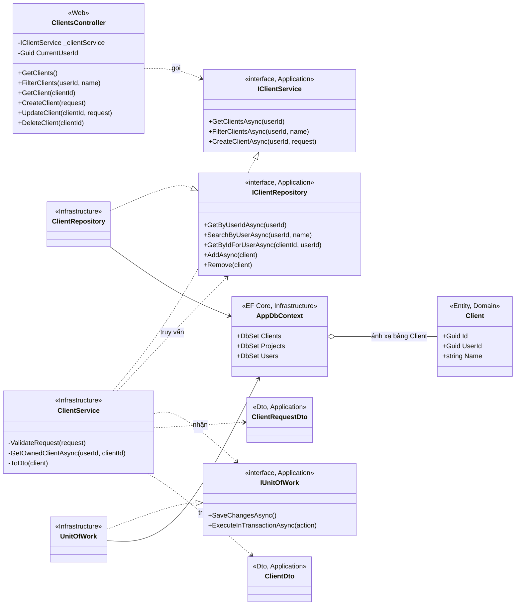
```mermaid
classDiagram
    direction LR

    class ClientsController {
        <<Web>>
        -IClientService _clientService
        -Guid CurrentUserId
        +GetClients()
        +FilterClients(userId, name)
        +GetClient(clientId)
        +CreateClient(request)
        +UpdateClient(clientId, request)
        +DeleteClient(clientId)
    }
    class IClientService {
        <<interface, Application>>
        +GetClientsAsync(userId)
        +FilterClientsAsync(userId, name)
        +CreateClientAsync(userId, request)
    }
    class ClientService {
        <<Infrastructure>>
        -ValidateRequest(request)
        -GetOwnedClientAsync(userId, clientId)
        -ToDto(client)
    }
    class IClientRepository {
        <<interface, Application>>
        +GetByUserIdAsync(userId)
        +SearchByUserAsync(userId, name)
        +GetByIdForUserAsync(clientId, userId)
        +AddAsync(client)
        +Remove(client)
    }
    class ClientRepository {
        <<Infrastructure>>
    }
    class IUnitOfWork {
        <<interface, Application>>
        +SaveChangesAsync()
        +ExecuteInTransactionAsync(action)
    }
    class UnitOfWork {
        <<Infrastructure>>
    }
    class AppDbContext {
        <<EF Core, Infrastructure>>
        +DbSet Clients
        +DbSet Projects
        +DbSet Users
    }
    class Client {
        <<Entity, Domain>>
        +Guid Id
        +Guid UserId
        +string Name
    }
    class ClientRequestDto {
        <<Dto, Application>>
    }
    class ClientDto {
        <<Dto, Application>>
    }

    ClientsController ..> IClientService : gọi
    ClientService ..|> IClientService
    ClientService ..> IClientRepository : truy vấn
    ClientService ..> IUnitOfWork : lưu
    ClientService ..> ClientRequestDto : nhận
    ClientService ..> ClientDto : trả
    ClientRepository ..|> IClientRepository
    UnitOfWork ..|> IUnitOfWork
    ClientRepository --> AppDbContext
    UnitOfWork --> AppDbContext
    AppDbContext o-- Client : ánh xạ bảng Client
```

#### 17.1.2 Mô hình dữ liệu: tài khoản và công việc
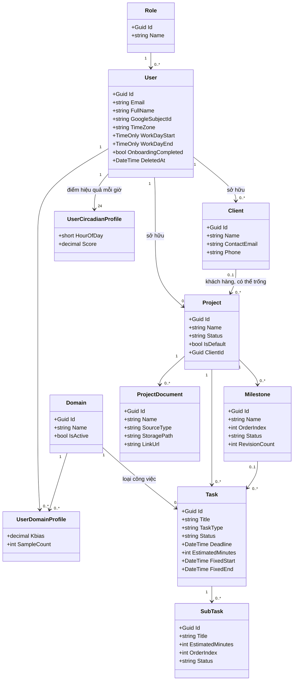
```mermaid
classDiagram
    direction TB

    class Role {
        +Guid Id
        +string Name
    }
    class User {
        +Guid Id
        +string Email
        +string FullName
        +string GoogleSubjectId
        +string TimeZone
        +TimeOnly WorkDayStart
        +TimeOnly WorkDayEnd
        +bool OnboardingCompleted
        +DateTime DeletedAt
    }
    class Client {
        +Guid Id
        +string Name
        +string ContactEmail
        +string Phone
    }
    class Project {
        +Guid Id
        +string Name
        +string Status
        +bool IsDefault
        +Guid ClientId
    }
    class Milestone {
        +Guid Id
        +string Name
        +int OrderIndex
        +string Status
        +int RevisionCount
    }
    class Domain {
        +Guid Id
        +string Name
        +bool IsActive
    }
    class Task {
        +Guid Id
        +string Title
        +string TaskType
        +string Status
        +DateTime Deadline
        +int EstimatedMinutes
        +DateTime FixedStart
        +DateTime FixedEnd
    }
    class SubTask {
        +Guid Id
        +string Title
        +int EstimatedMinutes
        +int OrderIndex
        +string Status
    }
    class ProjectDocument {
        +Guid Id
        +string Name
        +string SourceType
        +string StoragePath
        +string LinkUrl
    }
    class UserCircadianProfile {
        +short HourOfDay
        +decimal Score
    }
    class UserDomainProfile {
        +decimal Kbias
        +int SampleCount
    }

    Role "1" --> "0..*" User
    User "1" --> "0..*" Client : sở hữu
    User "1" --> "0..*" Project : sở hữu
    Client "0..1" --> "0..*" Project : khách hàng, có thể trống
    Project "1" --> "0..*" Milestone
    Project "1" --> "0..*" Task
    Project "1" --> "0..*" ProjectDocument
    Milestone "0..1" --> "0..*" Task
    Domain "1" --> "0..*" Task : loại công việc
    Task "1" --> "0..*" SubTask
    User "1" --> "24" UserCircadianProfile : điểm hiệu quả mỗi giờ
    User "1" --> "0..*" UserDomainProfile
    Domain "1" --> "0..*" UserDomainProfile
```

#### 17.1.3 Mô hình dữ liệu: lịch, Google và làm việc thực tế
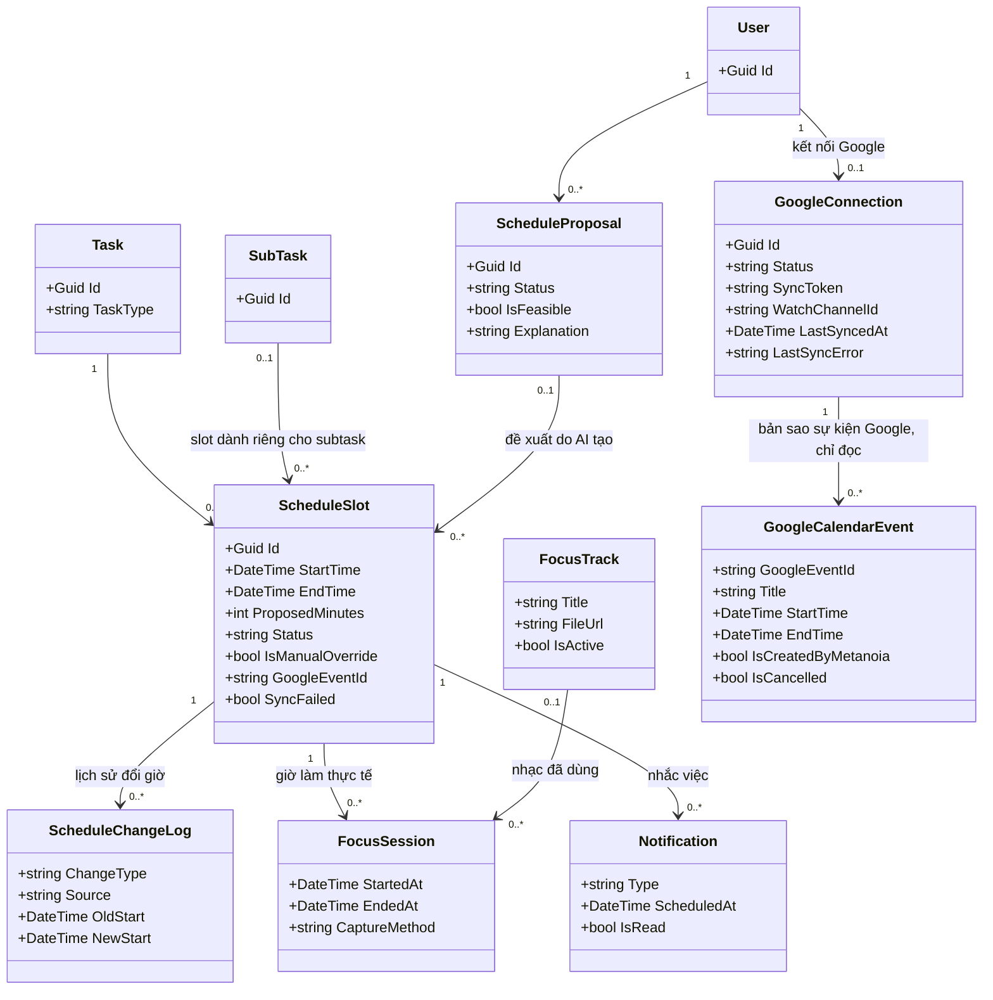
```mermaid
classDiagram
    direction TB

    class Task {
        +Guid Id
        +string TaskType
    }
    class SubTask {
        +Guid Id
    }
    class ScheduleProposal {
        +Guid Id
        +string Status
        +bool IsFeasible
        +string Explanation
    }
    class ScheduleSlot {
        +Guid Id
        +DateTime StartTime
        +DateTime EndTime
        +int ProposedMinutes
        +string Status
        +bool IsManualOverride
        +string GoogleEventId
        +bool SyncFailed
    }
    class ScheduleChangeLog {
        +string ChangeType
        +string Source
        +DateTime OldStart
        +DateTime NewStart
    }
    class FocusSession {
        +DateTime StartedAt
        +DateTime EndedAt
        +string CaptureMethod
    }
    class FocusTrack {
        +string Title
        +string FileUrl
        +bool IsActive
    }
    class Notification {
        +string Type
        +DateTime ScheduledAt
        +bool IsRead
    }
    class User {
        +Guid Id
    }
    class GoogleConnection {
        +Guid Id
        +string Status
        +string SyncToken
        +string WatchChannelId
        +DateTime LastSyncedAt
        +string LastSyncError
    }
    class GoogleCalendarEvent {
        +string GoogleEventId
        +string Title
        +DateTime StartTime
        +DateTime EndTime
        +bool IsCreatedByMetanoia
        +bool IsCancelled
    }

    Task "1" --> "0..*" ScheduleSlot
    SubTask "0..1" --> "0..*" ScheduleSlot : slot dành riêng cho subtask
    User "1" --> "0..*" ScheduleProposal
    ScheduleProposal "0..1" --> "0..*" ScheduleSlot : đề xuất do AI tạo
    ScheduleSlot "1" --> "0..*" ScheduleChangeLog : lịch sử đổi giờ
    ScheduleSlot "1" --> "0..*" FocusSession : giờ làm thực tế
    ScheduleSlot "1" --> "0..*" Notification : nhắc việc
    FocusTrack "0..1" --> "0..*" FocusSession : nhạc đã dùng
    User "1" --> "0..1" GoogleConnection : kết nối Google
    GoogleConnection "1" --> "0..*" GoogleCalendarEvent : bản sao sự kiện Google, chỉ đọc
```

#### 17.1.4 Mô hình dữ liệu: gói, thanh toán, phiên đăng nhập, nhật ký
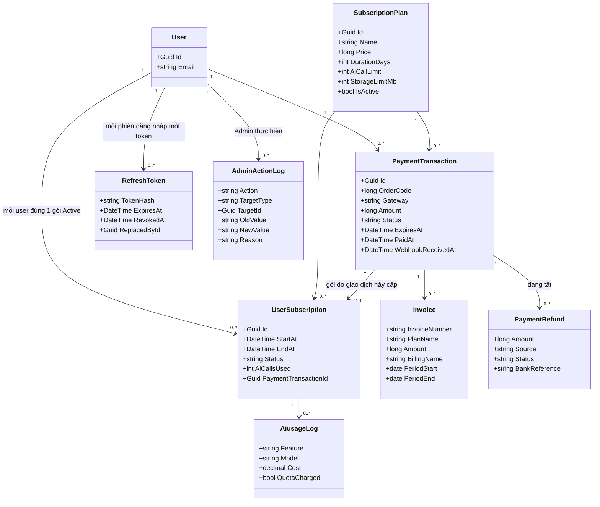
```mermaid
classDiagram
    direction TB

    class User {
        +Guid Id
        +string Email
    }
    class SubscriptionPlan {
        +Guid Id
        +string Name
        +long Price
        +int DurationDays
        +int AiCallLimit
        +int StorageLimitMb
        +bool IsActive
    }
    class UserSubscription {
        +Guid Id
        +DateTime StartAt
        +DateTime EndAt
        +string Status
        +int AiCallsUsed
        +Guid PaymentTransactionId
    }
    class PaymentTransaction {
        +Guid Id
        +long OrderCode
        +string Gateway
        +long Amount
        +string Status
        +DateTime ExpiresAt
        +DateTime PaidAt
        +DateTime WebhookReceivedAt
    }
    class Invoice {
        +string InvoiceNumber
        +string PlanName
        +long Amount
        +string BillingName
        +date PeriodStart
        +date PeriodEnd
    }
    class PaymentRefund {
        +long Amount
        +string Source
        +string Status
        +string BankReference
    }
    class AiusageLog {
        +string Feature
        +string Model
        +decimal Cost
        +bool QuotaCharged
    }
    class RefreshToken {
        +string TokenHash
        +DateTime ExpiresAt
        +DateTime RevokedAt
        +Guid ReplacedById
    }
    class AdminActionLog {
        +string Action
        +string TargetType
        +Guid TargetId
        +string OldValue
        +string NewValue
        +string Reason
    }

    User "1" --> "0..*" UserSubscription : mỗi user đúng 1 gói Active
    SubscriptionPlan "1" --> "0..*" UserSubscription
    User "1" --> "0..*" PaymentTransaction
    SubscriptionPlan "1" --> "0..*" PaymentTransaction
    PaymentTransaction "1" --> "0..1" UserSubscription : gói do giao dịch này cấp
    PaymentTransaction "1" --> "0..1" Invoice
    PaymentTransaction "1" --> "0..*" PaymentRefund : đang tắt
    UserSubscription "1" --> "0..*" AiusageLog
    User "1" --> "0..*" RefreshToken : mỗi phiên đăng nhập một token
    User "1" --> "0..*" AdminActionLog : Admin thực hiện
```

#### 17.1.5 Xác thực và phiên đăng nhập
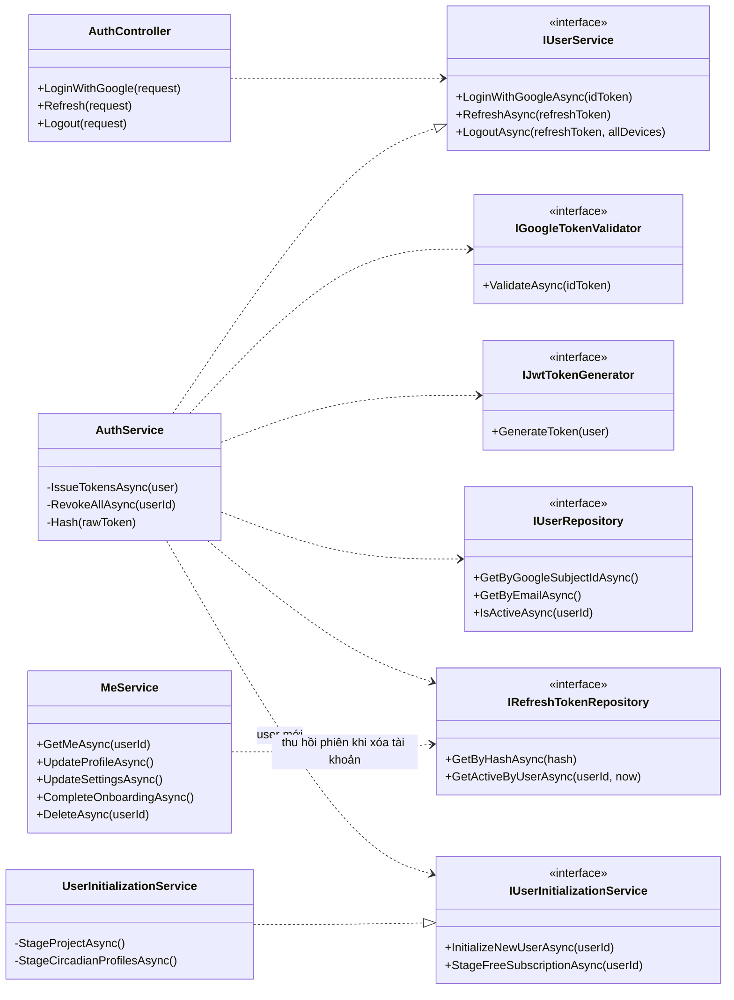
```mermaid
classDiagram
    direction LR

    class AuthController {
        +LoginWithGoogle(request)
        +Refresh(request)
        +Logout(request)
    }
    class IUserService {
        <<interface>>
        +LoginWithGoogleAsync(idToken)
        +RefreshAsync(refreshToken)
        +LogoutAsync(refreshToken, allDevices)
    }
    class AuthService {
        -IssueTokensAsync(user)
        -RevokeAllAsync(userId)
        -Hash(rawToken)
    }
    class IGoogleTokenValidator {
        <<interface>>
        +ValidateAsync(idToken)
    }
    class IJwtTokenGenerator {
        <<interface>>
        +GenerateToken(user)
    }
    class IUserRepository {
        <<interface>>
        +GetByGoogleSubjectIdAsync()
        +GetByEmailAsync()
        +IsActiveAsync(userId)
    }
    class IRefreshTokenRepository {
        <<interface>>
        +GetByHashAsync(hash)
        +GetActiveByUserAsync(userId, now)
    }
    class IUserInitializationService {
        <<interface>>
        +InitializeNewUserAsync(userId)
        +StageFreeSubscriptionAsync(userId)
    }
    class UserInitializationService {
        -StageProjectAsync()
        -StageCircadianProfilesAsync()
    }
    class MeService {
        +GetMeAsync(userId)
        +UpdateProfileAsync()
        +UpdateSettingsAsync()
        +CompleteOnboardingAsync()
        +DeleteAsync(userId)
    }

    AuthController ..> IUserService
    AuthService ..|> IUserService
    AuthService ..> IGoogleTokenValidator
    AuthService ..> IJwtTokenGenerator
    AuthService ..> IUserRepository
    AuthService ..> IRefreshTokenRepository
    AuthService ..> IUserInitializationService : user mới
    UserInitializationService ..|> IUserInitializationService
    MeService ..> IRefreshTokenRepository : thu hồi phiên khi xóa tài khoản
```

#### 17.1.6 Thanh toán PayOS
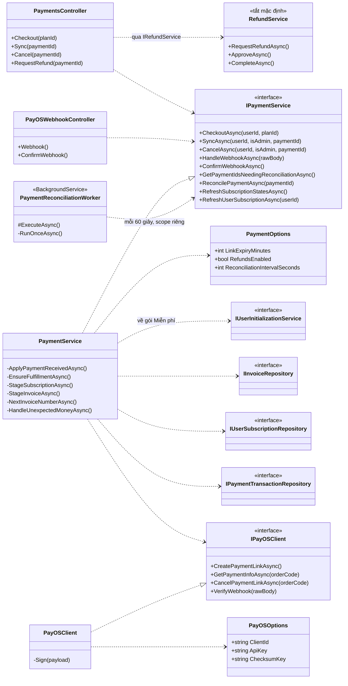
```mermaid
classDiagram
    direction LR

    class PaymentsController {
        +Checkout(planId)
        +Sync(paymentId)
        +Cancel(paymentId)
        +RequestRefund(paymentId)
    }
    class PayOSWebhookController {
        +Webhook()
        +ConfirmWebhook()
    }
    class IPaymentService {
        <<interface>>
        +CheckoutAsync(userId, planId)
        +SyncAsync(userId, isAdmin, paymentId)
        +CancelAsync(userId, isAdmin, paymentId)
        +HandleWebhookAsync(rawBody)
        +ConfirmWebhookAsync()
        +GetPaymentIdsNeedingReconciliationAsync()
        +ReconcilePaymentAsync(paymentId)
        +RefreshSubscriptionStatesAsync()
        +RefreshUserSubscriptionAsync(userId)
    }
    class PaymentService {
        -ApplyPaymentReceivedAsync()
        -EnsureFulfillmentAsync()
        -StageSubscriptionAsync()
        -StageInvoiceAsync()
        -NextInvoiceNumberAsync()
        -HandleUnexpectedMoneyAsync()
    }
    class IPayOSClient {
        <<interface>>
        +CreatePaymentLinkAsync()
        +GetPaymentInfoAsync(orderCode)
        +CancelPaymentLinkAsync(orderCode)
        +VerifyWebhook(rawBody)
    }
    class PayOSClient {
        -Sign(payload)
    }
    class PaymentOptions {
        +int LinkExpiryMinutes
        +bool RefundsEnabled
        +int ReconciliationIntervalSeconds
    }
    class PayOSOptions {
        +string ClientId
        +string ApiKey
        +string ChecksumKey
    }
    class IPaymentTransactionRepository {
        <<interface>>
    }
    class IUserSubscriptionRepository {
        <<interface>>
    }
    class IInvoiceRepository {
        <<interface>>
    }
    class IUserInitializationService {
        <<interface>>
    }
    class PaymentReconciliationWorker {
        <<BackgroundService>>
        #ExecuteAsync()
        -RunOnceAsync()
    }
    class RefundService {
        <<tắt mặc định>>
        +RequestRefundAsync()
        +ApproveAsync()
        +CompleteAsync()
    }

    PaymentsController ..> IPaymentService
    PayOSWebhookController ..> IPaymentService
    PaymentService ..|> IPaymentService
    PaymentService ..> IPayOSClient
    PayOSClient ..|> IPayOSClient
    PaymentService ..> IPaymentTransactionRepository
    PaymentService ..> IUserSubscriptionRepository
    PaymentService ..> IInvoiceRepository
    PaymentService ..> IUserInitializationService : về gói Miễn phí
    PaymentService ..> PaymentOptions
    PayOSClient ..> PayOSOptions
    PaymentReconciliationWorker ..> IPaymentService : mỗi 60 giây, scope riêng
    PaymentsController ..> RefundService : qua IRefundService
```

#### 17.1.7 Google Calendar
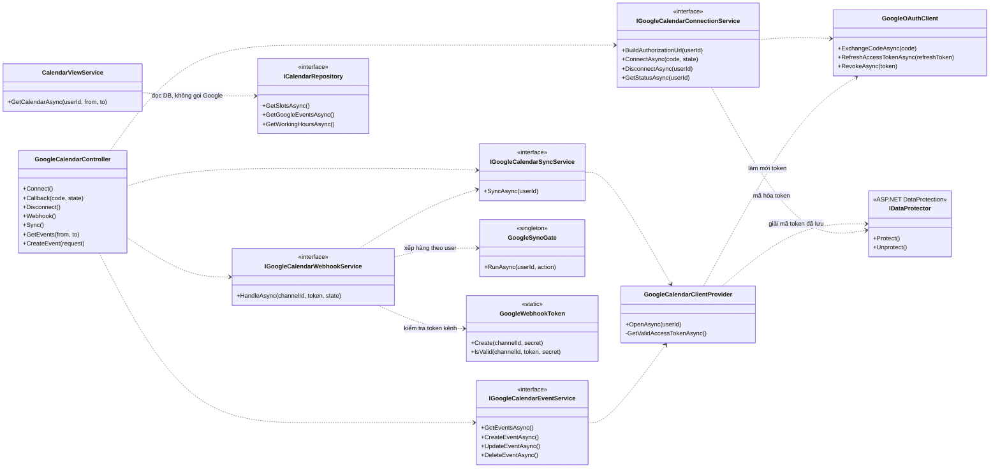
```mermaid
classDiagram
    direction LR

    class GoogleCalendarController {
        +Connect()
        +Callback(code, state)
        +Disconnect()
        +Webhook()
        +Sync()
        +GetEvents(from, to)
        +CreateEvent(request)
    }
    class IGoogleCalendarConnectionService {
        <<interface>>
        +BuildAuthorizationUrl(userId)
        +ConnectAsync(code, state)
        +DisconnectAsync(userId)
        +GetStatusAsync(userId)
    }
    class IGoogleCalendarSyncService {
        <<interface>>
        +SyncAsync(userId)
    }
    class IGoogleCalendarEventService {
        <<interface>>
        +GetEventsAsync()
        +CreateEventAsync()
        +UpdateEventAsync()
        +DeleteEventAsync()
    }
    class IGoogleCalendarWebhookService {
        <<interface>>
        +HandleAsync(channelId, token, state)
    }
    class GoogleCalendarClientProvider {
        +OpenAsync(userId)
        -GetValidAccessTokenAsync()
    }
    class GoogleOAuthClient {
        +ExchangeCodeAsync(code)
        +RefreshAccessTokenAsync(refreshToken)
        +RevokeAsync(token)
    }
    class GoogleSyncGate {
        <<singleton>>
        +RunAsync(userId, action)
    }
    class GoogleWebhookToken {
        <<static>>
        +Create(channelId, secret)
        +IsValid(channelId, token, secret)
    }
    class CalendarViewService {
        +GetCalendarAsync(userId, from, to)
    }
    class ICalendarRepository {
        <<interface>>
        +GetSlotsAsync()
        +GetGoogleEventsAsync()
        +GetWorkingHoursAsync()
    }
    class IDataProtector {
        <<ASP.NET DataProtection>>
        +Protect()
        +Unprotect()
    }

    GoogleCalendarController ..> IGoogleCalendarConnectionService
    GoogleCalendarController ..> IGoogleCalendarSyncService
    GoogleCalendarController ..> IGoogleCalendarEventService
    GoogleCalendarController ..> IGoogleCalendarWebhookService
    IGoogleCalendarWebhookService ..> GoogleSyncGate : xếp hàng theo user
    IGoogleCalendarWebhookService ..> GoogleWebhookToken : kiểm tra token kênh
    IGoogleCalendarWebhookService ..> IGoogleCalendarSyncService
    IGoogleCalendarSyncService ..> GoogleCalendarClientProvider
    IGoogleCalendarEventService ..> GoogleCalendarClientProvider
    IGoogleCalendarConnectionService ..> GoogleOAuthClient
    GoogleCalendarClientProvider ..> GoogleOAuthClient : làm mới token
    GoogleCalendarClientProvider ..> IDataProtector : giải mã token đã lưu
    IGoogleCalendarConnectionService ..> IDataProtector : mã hóa token
    CalendarViewService ..> ICalendarRepository : đọc DB, không gọi Google
```

#### 17.1.8 Quản trị, nhật ký thao tác và xử lý lỗi
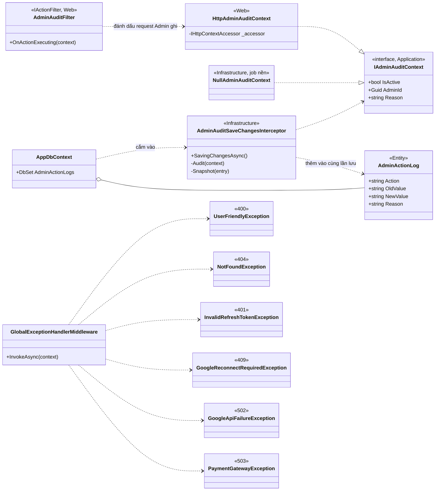
```mermaid
classDiagram
    direction LR

    class AdminAuditFilter {
        <<IActionFilter, Web>>
        +OnActionExecuting(context)
    }
    class IAdminAuditContext {
        <<interface, Application>>
        +bool IsActive
        +Guid AdminId
        +string Reason
    }
    class HttpAdminAuditContext {
        <<Web>>
        -IHttpContextAccessor _accessor
    }
    class NullAdminAuditContext {
        <<Infrastructure, job nền>>
    }
    class AdminAuditSaveChangesInterceptor {
        <<Infrastructure>>
        +SavingChangesAsync()
        -Audit(context)
        -Snapshot(entry)
    }
    class AppDbContext {
        +DbSet AdminActionLogs
    }
    class AdminActionLog {
        <<Entity>>
        +string Action
        +string OldValue
        +string NewValue
        +string Reason
    }
    class GlobalExceptionHandlerMiddleware {
        +InvokeAsync(context)
    }
    class UserFriendlyException {
        <<400>>
    }
    class NotFoundException {
        <<404>>
    }
    class InvalidRefreshTokenException {
        <<401>>
    }
    class GoogleReconnectRequiredException {
        <<409>>
    }
    class GoogleApiFailureException {
        <<502>>
    }
    class PaymentGatewayException {
        <<503>>
    }

    AdminAuditFilter ..> HttpAdminAuditContext : đánh dấu request Admin ghi
    HttpAdminAuditContext ..|> IAdminAuditContext
    NullAdminAuditContext ..|> IAdminAuditContext
    AdminAuditSaveChangesInterceptor ..> IAdminAuditContext
    AdminAuditSaveChangesInterceptor ..> AdminActionLog : thêm vào cùng lần lưu
    AppDbContext ..> AdminAuditSaveChangesInterceptor : cắm vào
    AppDbContext o-- AdminActionLog
    GlobalExceptionHandlerMiddleware ..> UserFriendlyException
    GlobalExceptionHandlerMiddleware ..> NotFoundException
    GlobalExceptionHandlerMiddleware ..> InvalidRefreshTokenException
    GlobalExceptionHandlerMiddleware ..> GoogleReconnectRequiredException
    GlobalExceptionHandlerMiddleware ..> GoogleApiFailureException
    GlobalExceptionHandlerMiddleware ..> PaymentGatewayException
```

### 17.2 Sequence diagram

#### 17.2.1 Một request có xác thực (xương sống của mọi API)
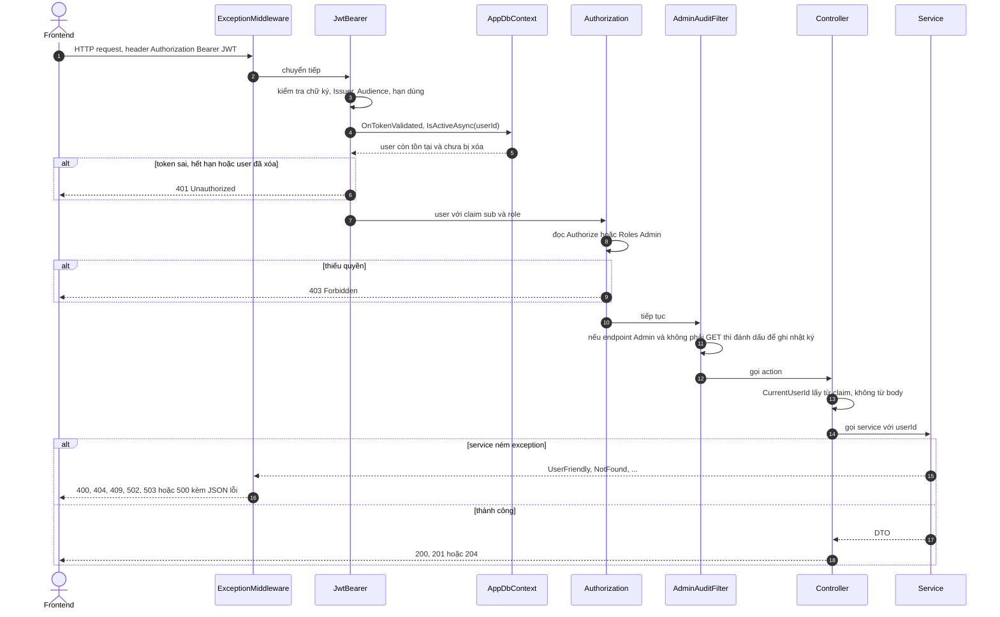
```mermaid
sequenceDiagram
    autonumber
    actor FE as Frontend
    participant MW as ExceptionMiddleware
    participant Auth as JwtBearer
    participant DB as AppDbContext
    participant Z as Authorization
    participant F as AdminAuditFilter
    participant C as Controller
    participant S as Service

    FE->>MW: HTTP request, header Authorization Bearer JWT
    MW->>Auth: chuyển tiếp
    Auth->>Auth: kiểm tra chữ ký, Issuer, Audience, hạn dùng
    Auth->>DB: OnTokenValidated, IsActiveAsync(userId)
    DB-->>Auth: user còn tồn tại và chưa bị xóa
    alt token sai, hết hạn hoặc user đã xóa
        Auth-->>FE: 401 Unauthorized
    end
    Auth->>Z: user với claim sub và role
    Z->>Z: đọc Authorize hoặc Roles Admin
    alt thiếu quyền
        Z-->>FE: 403 Forbidden
    end
    Z->>F: tiếp tục
    F->>F: nếu endpoint Admin và không phải GET thì đánh dấu để ghi nhật ký
    F->>C: gọi action
    C->>C: CurrentUserId lấy từ claim, không từ body
    C->>S: gọi service với userId
    alt service ném exception
        S-->>MW: UserFriendly, NotFound, ...
        MW-->>FE: 400, 404, 409, 502, 503 hoặc 500 kèm JSON lỗi
    else thành công
        S-->>C: DTO
        C-->>FE: 200, 201 hoặc 204
    end
```

#### 17.2.2 Đăng nhập Google lần đầu
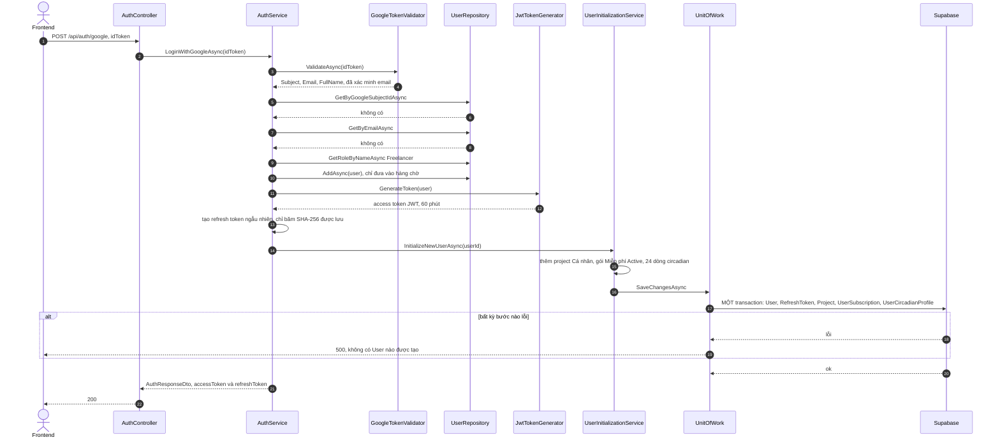
```mermaid
sequenceDiagram
    autonumber
    actor FE as Frontend
    participant C as AuthController
    participant A as AuthService
    participant G as GoogleTokenValidator
    participant R as UserRepository
    participant J as JwtTokenGenerator
    participant I as UserInitializationService
    participant U as UnitOfWork
    participant DB as Supabase

    FE->>C: POST /api/auth/google, idToken
    C->>A: LoginWithGoogleAsync(idToken)
    A->>G: ValidateAsync(idToken)
    G-->>A: Subject, Email, FullName, đã xác minh email
    A->>R: GetByGoogleSubjectIdAsync
    R-->>A: không có
    A->>R: GetByEmailAsync
    R-->>A: không có
    A->>R: GetRoleByNameAsync Freelancer
    A->>R: AddAsync(user), chỉ đưa vào hàng chờ
    A->>J: GenerateToken(user)
    J-->>A: access token JWT, 60 phút
    A->>A: tạo refresh token ngẫu nhiên, chỉ băm SHA-256 được lưu
    A->>I: InitializeNewUserAsync(userId)
    I->>I: thêm project Cá nhân, gói Miễn phí Active, 24 dòng circadian
    I->>U: SaveChangesAsync
    U->>DB: MỘT transaction: User, RefreshToken, Project, UserSubscription, UserCircadianProfile
    alt bất kỳ bước nào lỗi
        DB-->>U: lỗi
        U-->>FE: 500, không có User nào được tạo
    end
    DB-->>U: ok
    A-->>C: AuthResponseDto, accessToken và refreshToken
    C-->>FE: 200
```

#### 17.2.3 Làm mới phiên (xoay vòng refresh token)
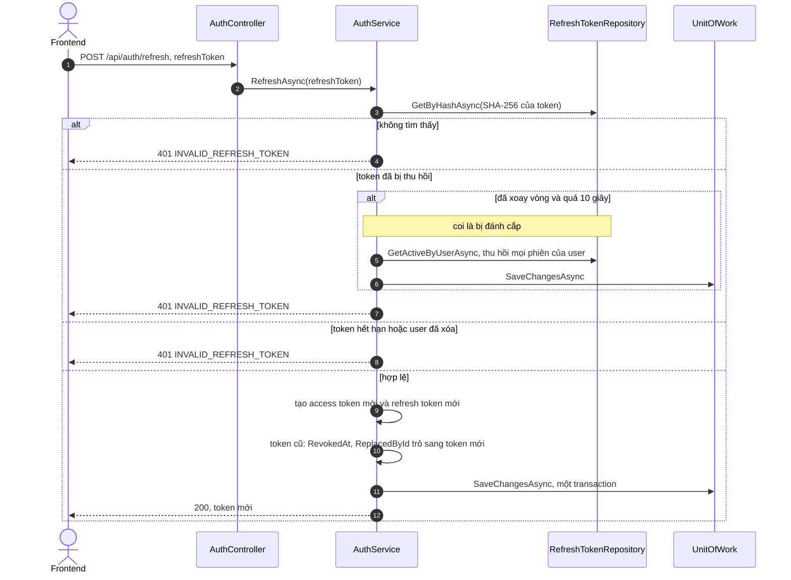
```mermaid
sequenceDiagram
    autonumber
    actor FE as Frontend
    participant C as AuthController
    participant A as AuthService
    participant T as RefreshTokenRepository
    participant U as UnitOfWork

    FE->>C: POST /api/auth/refresh, refreshToken
    C->>A: RefreshAsync(refreshToken)
    A->>T: GetByHashAsync(SHA-256 của token)
    alt không tìm thấy
        A-->>FE: 401 INVALID_REFRESH_TOKEN
    else token đã bị thu hồi
        alt đã xoay vòng và quá 10 giây
            Note over A,T: coi là bị đánh cắp
            A->>T: GetActiveByUserAsync, thu hồi mọi phiên của user
            A->>U: SaveChangesAsync
        end
        A-->>FE: 401 INVALID_REFRESH_TOKEN
    else token hết hạn hoặc user đã xóa
        A-->>FE: 401 INVALID_REFRESH_TOKEN
    else hợp lệ
        A->>A: tạo access token mới và refresh token mới
        A->>A: token cũ: RevokedAt, ReplacedById trỏ sang token mới
        A->>U: SaveChangesAsync, một transaction
        A-->>FE: 200, token mới
    end
```

#### 17.2.4 Hết hạn gói và tự về gói Miễn phí
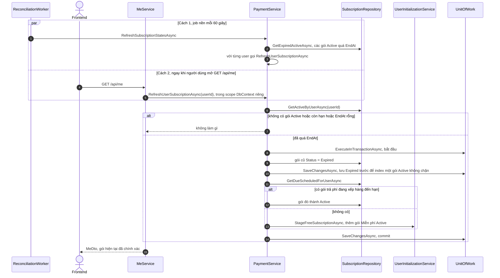
```mermaid
sequenceDiagram
    autonumber
    participant W as ReconciliationWorker
    actor FE as Frontend
    participant M as MeService
    participant P as PaymentService
    participant R as SubscriptionRepository
    participant I as UserInitializationService
    participant U as UnitOfWork

    par Cách 1, job nền mỗi 60 giây
        W->>P: RefreshSubscriptionStatesAsync
        P->>R: GetExpiredActiveAsync, các gói Active quá EndAt
        P->>P: với từng user gọi RefreshUserSubscriptionAsync
    and Cách 2, ngay khi người dùng mở GET /api/me
        FE->>M: GET /api/me
        M->>P: RefreshUserSubscriptionAsync(userId), trong scope DbContext riêng
    end
    P->>R: GetActiveByUserAsync(userId)
    alt không có gói Active hoặc còn hạn hoặc EndAt rỗng
        P-->>M: không làm gì
    else đã quá EndAt
        P->>U: ExecuteInTransactionAsync, bắt đầu
        P->>R: gói cũ Status = Expired
        P->>U: SaveChangesAsync, lưu Expired trước để index một gói Active không chặn
        P->>R: GetDueScheduledForUserAsync
        alt có gói trả phí đang xếp hàng đến hạn
            P->>R: gói đó thành Active
        else không có
            P->>I: StageFreeSubscriptionAsync, thêm gói Miễn phí Active
        end
        P->>U: SaveChangesAsync, commit
    end
    M-->>FE: MeDto, gói hiện tại đã chính xác
```

#### 17.2.5 Tạo link thanh toán (checkout)
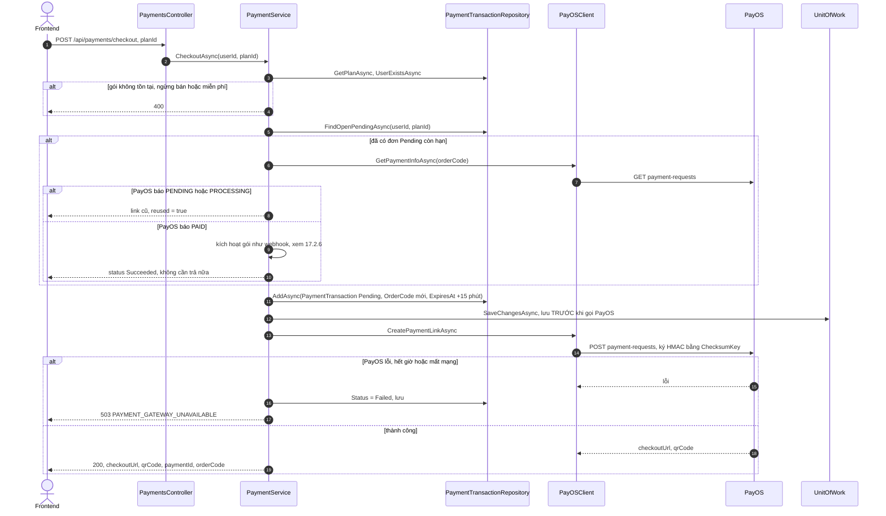
```mermaid
sequenceDiagram
    autonumber
    actor FE as Frontend
    participant C as PaymentsController
    participant P as PaymentService
    participant R as PaymentTransactionRepository
    participant X as PayOSClient
    participant PO as PayOS
    participant U as UnitOfWork

    FE->>C: POST /api/payments/checkout, planId
    C->>P: CheckoutAsync(userId, planId)
    P->>R: GetPlanAsync, UserExistsAsync
    alt gói không tồn tại, ngừng bán hoặc miễn phí
        P-->>FE: 400
    end
    P->>R: FindOpenPendingAsync(userId, planId)
    alt đã có đơn Pending còn hạn
        P->>X: GetPaymentInfoAsync(orderCode)
        X->>PO: GET payment-requests
        alt PayOS báo PENDING hoặc PROCESSING
            P-->>FE: link cũ, reused = true
        else PayOS báo PAID
            P->>P: kích hoạt gói như webhook, xem 17.2.6
            P-->>FE: status Succeeded, không cần trả nữa
        end
    end
    P->>R: AddAsync(PaymentTransaction Pending, OrderCode mới, ExpiresAt +15 phút)
    P->>U: SaveChangesAsync, lưu TRƯỚC khi gọi PayOS
    P->>X: CreatePaymentLinkAsync
    X->>PO: POST payment-requests, ký HMAC bằng ChecksumKey
    alt PayOS lỗi, hết giờ hoặc mất mạng
        PO-->>X: lỗi
        P->>R: Status = Failed, lưu
        P-->>FE: 503 PAYMENT_GATEWAY_UNAVAILABLE
    else thành công
        PO-->>X: checkoutUrl, qrCode
        P-->>FE: 200, checkoutUrl, qrCode, paymentId, orderCode
    end
```

#### 17.2.6 Thanh toán thành công qua webhook (cấp gói và hóa đơn)
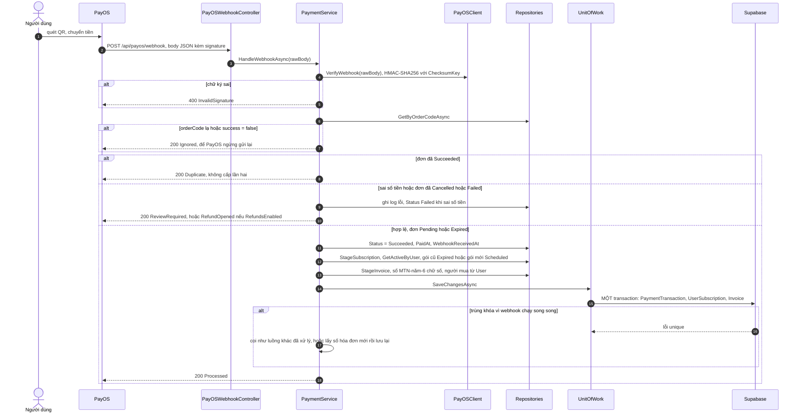
```mermaid
sequenceDiagram
    autonumber
    actor Khach as Người dùng
    participant PO as PayOS
    participant C as PayOSWebhookController
    participant P as PaymentService
    participant X as PayOSClient
    participant R as Repositories
    participant U as UnitOfWork
    participant DB as Supabase

    Khach->>PO: quét QR, chuyển tiền
    PO->>C: POST /api/payos/webhook, body JSON kèm signature
    C->>P: HandleWebhookAsync(rawBody)
    P->>X: VerifyWebhook(rawBody), HMAC-SHA256 với ChecksumKey
    alt chữ ký sai
        P-->>PO: 400 InvalidSignature
    end
    P->>R: GetByOrderCodeAsync
    alt orderCode lạ hoặc success = false
        P-->>PO: 200 Ignored, để PayOS ngừng gửi lại
    end
    alt đơn đã Succeeded
        P-->>PO: 200 Duplicate, không cấp lần hai
    else sai số tiền hoặc đơn đã Cancelled hoặc Failed
        P->>R: ghi log lỗi, Status Failed khi sai số tiền
        P-->>PO: 200 ReviewRequired, hoặc RefundOpened nếu RefundsEnabled
    else hợp lệ, đơn Pending hoặc Expired
        P->>R: Status = Succeeded, PaidAt, WebhookReceivedAt
        P->>R: StageSubscription, GetActiveByUser, gói cũ Expired hoặc gói mới Scheduled
        P->>R: StageInvoice, số MTN-năm-6 chữ số, người mua từ User
        P->>U: SaveChangesAsync
        U->>DB: MỘT transaction: PaymentTransaction, UserSubscription, Invoice
        alt trùng khóa vì webhook chạy song song
            DB-->>U: lỗi unique
            P->>P: coi như luồng khác đã xử lý, hoặc lấy số hóa đơn mới rồi lưu lại
        end
        P-->>PO: 200 Processed
    end
```

#### 17.2.7 Webhook bị lỡ: đối soát bằng sync hoặc worker
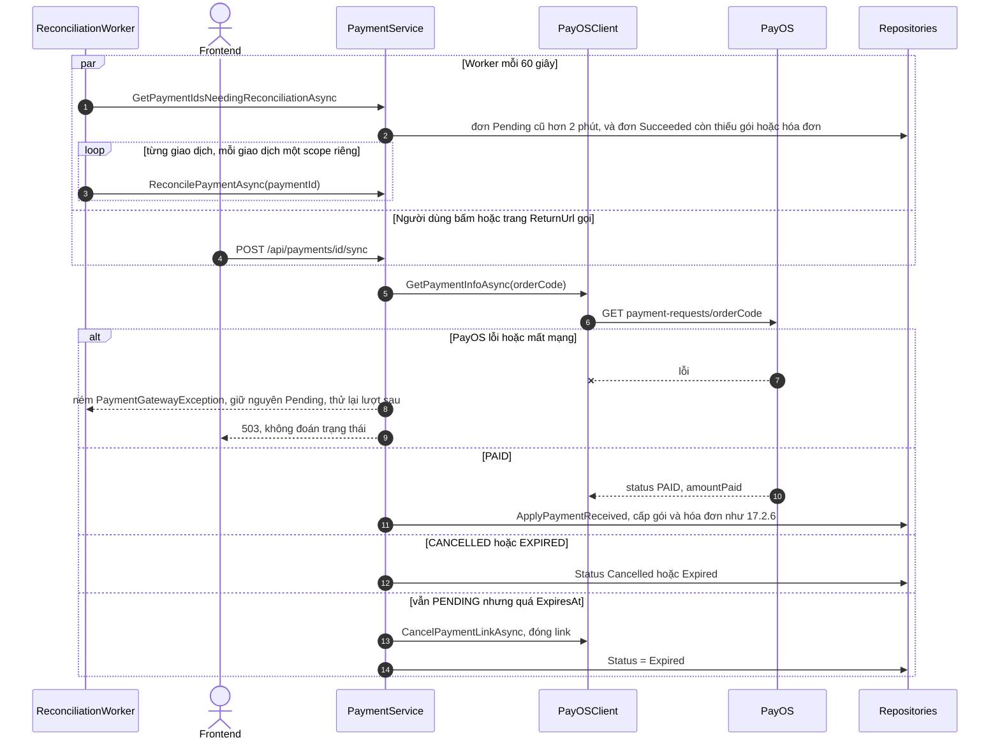
```mermaid
sequenceDiagram
    autonumber
    participant W as ReconciliationWorker
    actor FE as Frontend
    participant P as PaymentService
    participant X as PayOSClient
    participant PO as PayOS
    participant R as Repositories

    par Worker mỗi 60 giây
        W->>P: GetPaymentIdsNeedingReconciliationAsync
        P->>R: đơn Pending cũ hơn 2 phút, và đơn Succeeded còn thiếu gói hoặc hóa đơn
        loop từng giao dịch, mỗi giao dịch một scope riêng
            W->>P: ReconcilePaymentAsync(paymentId)
        end
    and Người dùng bấm hoặc trang ReturnUrl gọi
        FE->>P: POST /api/payments/id/sync
    end
    P->>X: GetPaymentInfoAsync(orderCode)
    X->>PO: GET payment-requests/orderCode
    alt PayOS lỗi hoặc mất mạng
        PO--xX: lỗi
        P-->>W: ném PaymentGatewayException, giữ nguyên Pending, thử lại lượt sau
        P-->>FE: 503, không đoán trạng thái
    else PAID
        PO-->>X: status PAID, amountPaid
        P->>R: ApplyPaymentReceived, cấp gói và hóa đơn như 17.2.6
    else CANCELLED hoặc EXPIRED
        P->>R: Status Cancelled hoặc Expired
    else vẫn PENDING nhưng quá ExpiresAt
        P->>X: CancelPaymentLinkAsync, đóng link
        P->>R: Status = Expired
    end
```

#### 17.2.8 Kết nối Google Calendar và đồng bộ
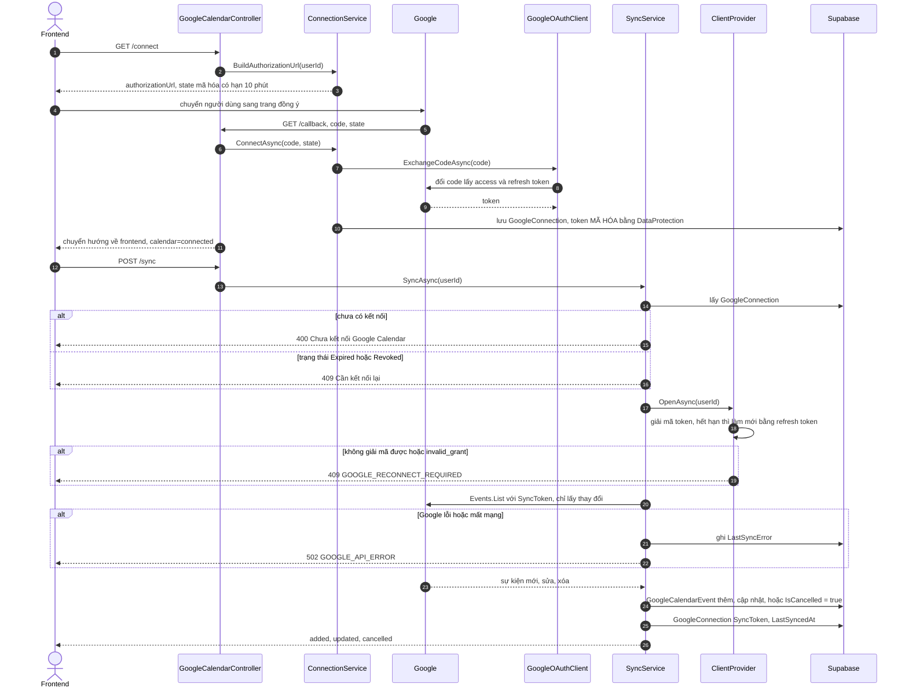
```mermaid
sequenceDiagram
    autonumber
    actor FE as Frontend
    participant C as GoogleCalendarController
    participant K as ConnectionService
    participant GG as Google
    participant O as GoogleOAuthClient
    participant S as SyncService
    participant PR as ClientProvider
    participant DB as Supabase

    FE->>C: GET /connect
    C->>K: BuildAuthorizationUrl(userId)
    K-->>FE: authorizationUrl, state mã hóa có hạn 10 phút
    FE->>GG: chuyển người dùng sang trang đồng ý
    GG->>C: GET /callback, code, state
    C->>K: ConnectAsync(code, state)
    K->>O: ExchangeCodeAsync(code)
    O->>GG: đổi code lấy access và refresh token
    GG-->>O: token
    K->>DB: lưu GoogleConnection, token MÃ HÓA bằng DataProtection
    C-->>FE: chuyển hướng về frontend, calendar=connected

    FE->>C: POST /sync
    C->>S: SyncAsync(userId)
    S->>DB: lấy GoogleConnection
    alt chưa có kết nối
        S-->>FE: 400 Chưa kết nối Google Calendar
    else trạng thái Expired hoặc Revoked
        S-->>FE: 409 Cần kết nối lại
    end
    S->>PR: OpenAsync(userId)
    PR->>PR: giải mã token, hết hạn thì làm mới bằng refresh token
    alt không giải mã được hoặc invalid_grant
        PR-->>FE: 409 GOOGLE_RECONNECT_REQUIRED
    end
    S->>GG: Events.List với SyncToken, chỉ lấy thay đổi
    alt Google lỗi hoặc mất mạng
        S->>DB: ghi LastSyncError
        S-->>FE: 502 GOOGLE_API_ERROR
    end
    GG-->>S: sự kiện mới, sửa, xóa
    S->>DB: GoogleCalendarEvent thêm, cập nhật, hoặc IsCancelled = true
    S->>DB: GoogleConnection SyncToken, LastSyncedAt
    S-->>FE: added, updated, cancelled
```

#### 17.2.9 Google báo lịch thay đổi (webhook)
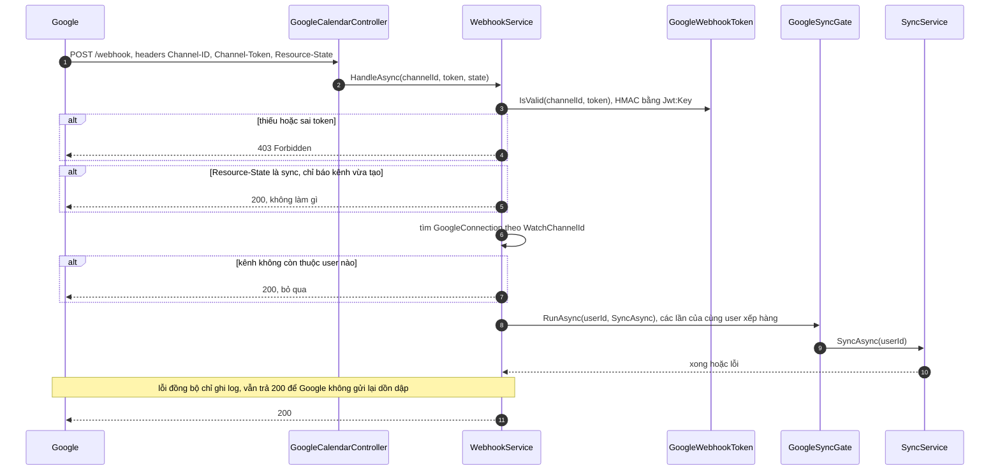
```mermaid
sequenceDiagram
    autonumber
    participant GG as Google
    participant C as GoogleCalendarController
    participant W as WebhookService
    participant T as GoogleWebhookToken
    participant G as GoogleSyncGate
    participant S as SyncService

    GG->>C: POST /webhook, headers Channel-ID, Channel-Token, Resource-State
    C->>W: HandleAsync(channelId, token, state)
    W->>T: IsValid(channelId, token), HMAC bằng Jwt:Key
    alt thiếu hoặc sai token
        W-->>GG: 403 Forbidden
    end
    alt Resource-State là sync, chỉ báo kênh vừa tạo
        W-->>GG: 200, không làm gì
    end
    W->>W: tìm GoogleConnection theo WatchChannelId
    alt kênh không còn thuộc user nào
        W-->>GG: 200, bỏ qua
    end
    W->>G: RunAsync(userId, SyncAsync), các lần của cùng user xếp hàng
    G->>S: SyncAsync(userId)
    S-->>W: xong hoặc lỗi
    Note over W,GG: lỗi đồng bộ chỉ ghi log, vẫn trả 200 để Google không gửi lại dồn dập
    W-->>GG: 200
```

#### 17.2.10 Xem lịch gộp (GET /api/calendar)
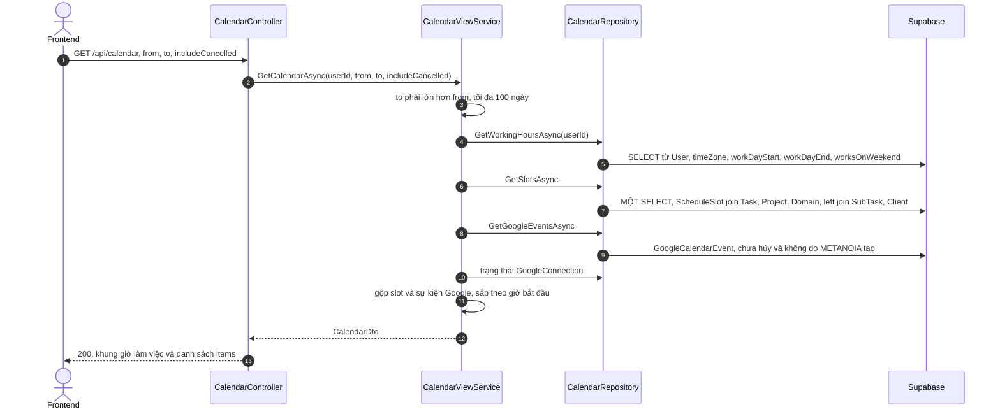
```mermaid
sequenceDiagram
    autonumber
    actor FE as Frontend
    participant C as CalendarController
    participant V as CalendarViewService
    participant R as CalendarRepository
    participant DB as Supabase

    FE->>C: GET /api/calendar, from, to, includeCancelled
    C->>V: GetCalendarAsync(userId, from, to, includeCancelled)
    V->>V: to phải lớn hơn from, tối đa 100 ngày
    V->>R: GetWorkingHoursAsync(userId)
    R->>DB: SELECT từ User, timeZone, workDayStart, workDayEnd, worksOnWeekend
    V->>R: GetSlotsAsync
    R->>DB: MỘT SELECT, ScheduleSlot join Task, Project, Domain, left join SubTask, Client
    V->>R: GetGoogleEventsAsync
    R->>DB: GoogleCalendarEvent, chưa hủy và không do METANOIA tạo
    V->>R: trạng thái GoogleConnection
    V->>V: gộp slot và sự kiện Google, sắp theo giờ bắt đầu
    V-->>C: CalendarDto
    C-->>FE: 200, khung giờ làm việc và danh sách items
```

#### 17.2.11 AI đề xuất lịch, duyệt đề xuất, AI học
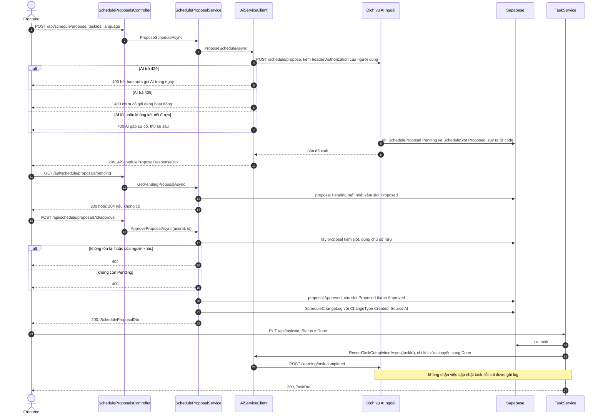
```mermaid
sequenceDiagram
    autonumber
    actor FE as Frontend
    participant SC as ScheduleProposalsController
    participant SP as ScheduleProposalService
    participant AI as AiServiceClient
    participant AS as Dịch vụ AI ngoài
    participant DB as Supabase
    participant T as TaskService

    FE->>SC: POST /api/schedule/propose, taskIds, language
    SC->>SP: ProposeScheduleAsync
    SP->>AI: ProposeScheduleAsync
    AI->>AS: POST /schedule/propose, kèm header Authorization của người dùng
    alt AI trả 429
        AI-->>FE: 400 hết hạn mức gọi AI trong ngày
    else AI trả 409
        AI-->>FE: 400 chưa có gói đang hoạt động
    else AI lỗi hoặc không kết nối được
        AI-->>FE: 400 AI gặp sự cố, thử lại sau
    end
    AS->>DB: ghi ScheduleProposal Pending và ScheduleSlot Proposed, suy ra từ code
    AS-->>AI: bản đề xuất
    AI-->>FE: 200, AiScheduleProposalResponseDto

    FE->>SC: GET /api/schedule/proposals/pending
    SC->>SP: GetPendingProposalAsync
    SP->>DB: proposal Pending mới nhất kèm slot Proposed
    SP-->>FE: 200 hoặc 204 nếu không có

    FE->>SC: POST /api/schedule/proposals/id/approve
    SC->>SP: ApproveProposalAsync(userId, id)
    SP->>DB: lấy proposal kèm slot, đúng chủ sở hữu
    alt không tồn tại hoặc của người khác
        SP-->>FE: 404
    else không còn Pending
        SP-->>FE: 400
    end
    SP->>DB: proposal Approved, các slot Proposed thành Approved
    SP->>DB: ScheduleChangeLog với ChangeType Created, Source AI
    SP-->>FE: 200, ScheduleProposalDto

    FE->>T: PUT /api/tasks/id, Status = Done
    T->>DB: lưu task
    T->>AI: RecordTaskCompletionAsync(taskId), chỉ khi vừa chuyển sang Done
    AI->>AS: POST /learning/task-completed
    Note over T,AS: không chặn việc cập nhật task, lỗi chỉ được ghi log
    T-->>FE: 200, TaskDto
```

#### 17.2.12 Thao tác của Admin và ghi nhật ký tự động
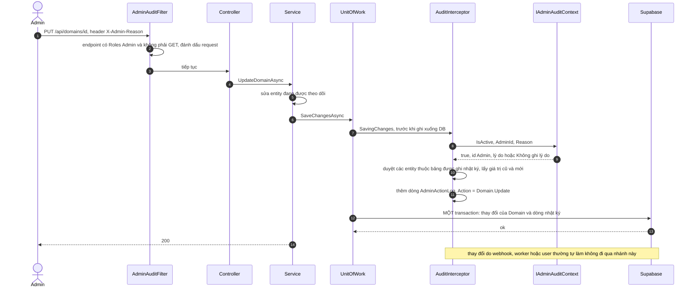
```mermaid
sequenceDiagram
    autonumber
    actor AD as Admin
    participant F as AdminAuditFilter
    participant C as Controller
    participant S as Service
    participant U as UnitOfWork
    participant I as AuditInterceptor
    participant X as IAdminAuditContext
    participant DB as Supabase

    AD->>F: PUT /api/domains/id, header X-Admin-Reason
    F->>F: endpoint có Roles Admin và không phải GET, đánh dấu request
    F->>C: tiếp tục
    C->>S: UpdateDomainAsync
    S->>S: sửa entity đang được theo dõi
    S->>U: SaveChangesAsync
    U->>I: SavingChanges, trước khi ghi xuống DB
    I->>X: IsActive, AdminId, Reason
    X-->>I: true, id Admin, lý do hoặc Không ghi lý do
    I->>I: duyệt các entity thuộc bảng được ghi nhật ký, lấy giá trị cũ và mới
    I->>I: thêm dòng AdminActionLog, Action = Domain.Update
    U->>DB: MỘT transaction: thay đổi của Domain và dòng nhật ký
    DB-->>U: ok
    S-->>AD: 200
    Note over I,DB: thay đổi do webhook, worker hoặc user thường tự làm không đi qua nhánh này
```


---

## 18. Business rule (quy tắc nghiệp vụ)

Mục này gom các luật mà hệ thống **tự áp dụng**, theo từng nhóm. Mỗi luật có mã `BR-xx` để trích dẫn khi review hoặc viết test.
Cột *Vi phạm thì* cho biết kết quả với người gọi API: `400` là `UserFriendlyException`, `404` là `NotFoundException` (xem bảng exception ở mục 4).
Các luật này nằm trong **Service** (`METANOIA.Infrastructure/Services`), không nằm ở Controller và không nằm ở entity.
Vì DB-first, một số luật còn có ràng buộc tương ứng trong database (CHECK, unique index). Khi sửa luật nhớ sửa cả hai phía, xem mục 14.

Quy ước chung cho mọi nhóm:

| Mã | Luật | Vi phạm thì |
|---|---|---|
| BR-00a | Mọi dữ liệu của người dùng chỉ truy cập được qua chủ sở hữu. Service luôn lọc theo `userId` lấy từ JWT, không từ body | `404` (không lộ việc bản ghi có tồn tại) |
| BR-00b | Chuỗi bắt buộc được `Trim()`, không được rỗng và có độ dài tối đa theo cột DB | `400` |
| BR-00c | Thời gian lưu và trả về theo UTC. Múi giờ chỉ dùng để hiển thị và để chia ngày làm việc | không áp dụng |
| BR-00d | Đổi trạng thái hoặc xóa có hệ quả phải nằm trong **một lần `SaveChanges`** (một transaction). Lỗi giữa chừng thì không có gì được lưu | `500` và rollback |
| BR-00e | Dữ liệu đã phát sinh lịch sử thì **không xóa**, chỉ đổi trạng thái (xem từng nhóm) | `400` |

### 18.1 Tài khoản, đăng nhập và phiên

| Mã | Luật | Vi phạm thì |
|---|---|---|
| BR-01 | Chỉ đăng nhập bằng Google. Email Google phải được **xác minh** | `400` Email Google chưa được xác minh |
| BR-02 | Người mới tự đăng ký có role **Freelancer**. Role `Admin` chỉ được cấp bởi Admin | không áp dụng |
| BR-03 | Tạo người mới là **một transaction**: `User` + `RefreshToken` đầu tiên + project "Cá nhân" (`IsDefault = true`) + gói **Miễn phí** `Active` + **24 dòng** `UserCircadianProfile` (điểm mặc định 0.5). Lỗi ở bước nào thì không có `User` nào được tạo | `500`, không còn dữ liệu nửa vời |
| BR-04 | Mặc định người mới: múi giờ `Asia/Ho_Chi_Minh`, làm việc 08:00 đến 18:00, không làm cuối tuần, đệm 15 phút, nhắc trước 15 phút, `OnboardingCompleted = false` | không áp dụng |
| BR-05 | Admin tạo sẵn tài khoản thì `GoogleSubjectId = "pending:<guid>"`. Người có **đúng email đó** đăng nhập Google lần đầu sẽ nhận tài khoản. Email trùng mà không phải loại `pending:` hoặc đã bị xóa thì không được nhận | `400` Email này đã được đăng ký bằng phương thức khác |
| BR-06 | Tài khoản đã soft delete (`DeletedAt != null`) không đăng nhập được. Admin phải khôi phục trước | `400` Tài khoản này đã bị xóa |
| BR-07 | Access token (JWT) mặc định sống **60 phút** (`Jwt:ExpiryMinutes`). Mỗi request còn kiểm tra user chưa bị xóa. Token của user đã xóa bị từ chối ngay dù chưa hết hạn | `401` |
| BR-08 | Refresh token: 32 byte ngẫu nhiên, mặc định sống **30 ngày** (`Jwt:RefreshTokenDays`), DB chỉ lưu **băm SHA-256**. Mỗi lần refresh **xoay vòng**: token cũ bị thu hồi và trỏ sang token mới | `401` INVALID_REFRESH_TOKEN |
| BR-09 | Dùng lại một refresh token đã xoay vòng sau quá **10 giây** thì coi là bị đánh cắp và **thu hồi mọi phiên** của user. Trong 10 giây là ân hạn cho trường hợp frontend gọi hai lần | `401` |
| BR-10 | Đăng xuất luôn thành công, kể cả token lạ hoặc đã thu hồi. `allDevices = true` thu hồi mọi phiên | luôn `204` |
| BR-11 | Người dùng tự xóa tài khoản (`DELETE /api/me`) là **soft delete**: đặt `DeletedAt`, thu hồi mọi refresh token, ngắt kết nối Google, tất cả trong một lần lưu. Dữ liệu cũ vẫn giữ | không áp dụng |
| BR-12 | Giờ kết thúc làm việc phải **sau** giờ bắt đầu. Đệm và nhắc trước nằm trong **0 đến 120 phút**. Múi giờ phải là tên IANA có thật, ví dụ `Asia/Ho_Chi_Minh` | `400` |
| BR-13 | Họ tên tối đa 100 ký tự và không được rỗng | `400` |

**Quy tắc riêng của Admin quản lý người dùng**

| Mã | Luật | Vi phạm thì |
|---|---|---|
| BR-14 | Email phải hợp lệ, tối đa 255 ký tự và **duy nhất kể cả với tài khoản đã xóa** | `400` |
| BR-15 | Không được hạ quyền hoặc xóa **Admin cuối cùng** của hệ thống | `400` |
| BR-16 | Admin không tự xóa chính mình qua `/api/admin/users`. Phải dùng `DELETE /api/me` | `400` |
| BR-17 | Không sửa được tài khoản đã xóa, phải khôi phục trước. Khôi phục thất bại nếu email đó đã bị tài khoản khác dùng | `400` |
| BR-18 | Danh sách phân trang: `page` từ 1 trở lên, `pageSize` từ 1 đến **100** (mặc định 20) | `400` |

**Onboarding (`POST /api/me/onboarding`)**

| Mã | Luật | Vi phạm thì |
|---|---|---|
| BR-19 | Mức "hay làm lố" quy ra hệ số học (`KBias`) khởi tạo cho từng loại công việc: `Rarely` 1.10, `Sometimes` 1.25, `Often` 1.50, `Always` 1.80 | `400` nếu giá trị lạ |
| BR-20 | Giờ làm hiệu quả nằm trong 0 đến 23. Điểm mỗi giờ: giờ hiệu quả **0.8**, giờ trong khung làm việc **0.5**, ngoài khung **0.2** | `400` |
| BR-21 | Loại công việc (Domain) được chọn phải tồn tại và đang bật (`IsActive`) | `400` |
| BR-22 | Nếu hồ sơ domain đã có dữ liệu học thật (`SampleCount > 0)` thì **giữ nguyên** `KBias` đã học, onboarding không ghi đè | không áp dụng |

### 18.2 Gói dịch vụ và hết hạn

| Mã | Luật | Vi phạm thì |
|---|---|---|
| BR-23 | Mỗi người dùng có **đúng một** gói `Active` tại mọi thời điểm. DB có unique partial index bảo vệ | `400` hoặc lỗi unique |
| BR-24 | Trạng thái gói: `Active`, `Scheduled` (xếp hàng chờ), `Expired`, `Cancelled` | `400` nếu giá trị lạ |
| BR-25 | Gói Miễn phí không có ngày hết hạn (`EndAt = null`) và không bán qua thanh toán | `400` Gói miễn phí không cần thanh toán |
| BR-26 | Mua gói trả phí khi gói hiện tại **còn hạn** thì gói mới thành `Scheduled`, bắt đầu đúng lúc gói cũ hết (**cộng dồn thời gian, không mất ngày đã trả**) | không áp dụng |
| BR-27 | Mua gói khi gói hiện tại là Miễn phí hoặc đã quá hạn thì gói cũ thành `Expired` và gói mới `Active` ngay, bắt đầu từ lúc mua | không áp dụng |
| BR-28 | Hết hạn: gói `Active` quá `EndAt` thì thành `Expired`, rồi bật gói `Scheduled` đến hạn nếu có, **không có thì tự về gói Miễn phí**. Xử lý ngay khi người dùng mở `GET /api/me` và nhờ job nền mỗi 60 giây | không áp dụng |
| BR-29 | `EndAt = StartAt + DurationDays` của gói. `EndAt` phải lớn hơn `StartAt`. Số lượt AI đã dùng không âm | `400` |
| BR-30 | Hạn mức: `AiCallLimit` và `ProjectLimit` để trống nghĩa là **không giới hạn**. `Price` không âm, `DurationDays` và `StorageLimitMb` lớn hơn 0 | `400` |
| BR-31 | Tên gói duy nhất, **không phân biệt hoa thường**, tối đa 50 ký tự | `400` |
| BR-32 | Gói đã có người dùng hoặc giao dịch thì **không xóa**, chỉ đặt `IsActive = false`. Gói đăng ký của người dùng đã phát sinh lượt gọi AI cũng không xóa, chỉ đổi sang `Cancelled` | `400` |
| BR-33 | Một giao dịch thanh toán chỉ gắn với **một** gói đăng ký | `400` |

```mermaid
stateDiagram-v2
    direction LR
    [*] --> Active : đăng ký (gói Miễn phí) hoặc mua khi chưa có gói còn hạn
    [*] --> Scheduled : mua khi gói hiện tại còn hạn
    Scheduled --> Active : gói trước hết hạn
    Active --> Expired : quá EndAt
    Active --> Cancelled : hoàn tiền được duyệt
    Scheduled --> Cancelled : hoàn tiền được duyệt
    Expired --> [*]
    Cancelled --> [*]
```

### 18.3 Thanh toán PayOS

| Mã | Luật | Vi phạm thì |
|---|---|---|
| BR-34 | Chỉ mua được gói **tồn tại**, **đang bán** (`IsActive`) và **có giá lớn hơn 0** | `400` |
| BR-35 | Bấm thanh toán nhiều lần cho cùng gói: dùng lại **link còn sống** thay vì tạo đơn mới. Nếu PayOS báo link đó đã trả tiền thì xử lý như đã thanh toán | kết quả `reused = true` |
| BR-36 | Đơn được **lưu vào DB trước** khi gọi PayOS, để lỡ mất mạng vẫn có `OrderCode` đối soát. Link sống **15 phút** | không áp dụng |
| BR-37 | PayOS lỗi hoặc mất mạng lúc tạo link: đơn thành `Failed` (khách chưa nhận link nên chưa thể trả tiền) | `503` |
| BR-38 | Tiền chỉ được công nhận khi **webhook có chữ ký HMAC-SHA256 hợp lệ** (`ChecksumKey`), hoặc khi chính server hỏi PayOS và PayOS trả `PAID`. Không tin dữ liệu do trình duyệt gửi | `400` chữ ký sai |
| BR-39 | **Số tiền nhận được phải bằng số tiền của đơn.** Lệch thì đơn thành `Failed`, không cấp gói, ghi log lỗi | webhook trả `ReviewRequired` |
| BR-40 | Tiền về sau khi đơn đã `Cancelled` hoặc `Failed` thì không cấp gói, ghi log lỗi để người xử lý | webhook trả `ReviewRequired` |
| BR-41 | Tiền về sát giờ hết hạn (đơn đang `Expired`) vẫn được **chấp nhận** và cấp gói | `Processed` |
| BR-42 | **Idempotent:** webhook gửi lại, hoặc worker và `sync` cùng chạy, không bao giờ cấp gói hai lần. Đơn đã `Succeeded` chỉ được kiểm tra bổ sung phần còn thiếu (gói hoặc hóa đơn) | `Duplicate` |
| BR-43 | Thanh toán thành công thì trong **một lần lưu**: đơn `Succeeded` + `UserSubscription` + `Invoice` | xem BR-00d |
| BR-44 | Số hóa đơn có dạng `MTN-<năm>-<6 chữ số>`, tăng dần theo năm, **duy nhất**. Trùng do hai giao dịch cùng lúc thì lấy số mới và lưu lại (tối đa 5 lần) | lỗi sau 5 lần |
| BR-45 | Hóa đơn lấy tên và email người mua từ `User`, kỳ hóa đơn bằng thời hạn gói vừa cấp (tính theo múi giờ người mua). Số tiền hóa đơn **phải khớp** số tiền giao dịch. Mỗi giao dịch chỉ có **một** hóa đơn | `400` |
| BR-46 | Hủy thanh toán chỉ áp dụng cho đơn `Pending`. Đơn `Succeeded` không hủy được. Đơn đã kết thúc thì hủy lại không có tác dụng | `400` / bỏ qua |
| BR-47 | Lỗi mạng khi hủy hoặc đồng bộ: **giữ nguyên `Pending`** và báo lỗi. Không đoán trạng thái vì link PayOS có thể vẫn còn sống | `503` |
| BR-48 | Đối soát: đơn `Pending` cũ hơn **2 phút** được hỏi lại PayOS. Quá `ExpiresAt` + 60 giây mà vẫn chưa trả thì đóng link và đặt `Expired`. Nếu PayOS không cho đóng (có thể vừa trả) thì chờ lượt sau | không áp dụng |
| BR-49 | Người dùng chỉ thấy, đồng bộ và hủy được giao dịch của **chính mình**. Admin thấy tất cả | `404` |
| BR-50 | Giao dịch đã có hóa đơn, hoặc đã gắn gói đăng ký, hoặc đã có yêu cầu hoàn tiền thì **không xóa** | `400` |
| BR-51 | Dữ liệu giao dịch do Admin nhập tay: cổng là `PayOS` hoặc `VNPay`, số tiền lớn hơn 0, `OrderCode` dương và duy nhất, `ExpiresAt` lớn hơn `CreatedAt` | `400` |

```mermaid
stateDiagram-v2
    direction LR
    [*] --> Pending : checkout
    Pending --> Succeeded : webhook PAID, sync hoặc worker, đúng số tiền
    Pending --> Failed : sai số tiền, hoặc PayOS lỗi lúc tạo link
    Pending --> Cancelled : người dùng hủy
    Pending --> Expired : quá hạn mà chưa trả
    Expired --> Succeeded : tiền về sát giờ
    Succeeded --> [*]
    Failed --> [*]
    Cancelled --> [*]
```

### 18.4 Hoàn tiền (đang tắt)

Toàn bộ nhóm này chỉ có hiệu lực khi `Payments:RefundsEnabled = true`. Khi tắt, mọi API hoàn tiền trả `400 Chức năng hoàn tiền chưa được bật` và luồng thanh toán không đụng tới bảng `PaymentRefund`.

| Mã | Luật | Vi phạm thì |
|---|---|---|
| BR-52 | Chỉ hoàn tiền cho giao dịch `Succeeded` của **chính người dùng** | `400` / `404` |
| BR-53 | Mỗi giao dịch chỉ có **một** yêu cầu hoàn tiền đang xử lý | `400` |
| BR-54 | Khách tự yêu cầu trong **7 ngày** kể từ lúc thanh toán (`RefundWindowDays`). Quá hạn phải liên hệ hỗ trợ | `400` |
| BR-55 | Gói đã dùng (`AiCallsUsed > 0`) thì không tự yêu cầu được | `400` |
| BR-56 | Phải có lý do, tối đa 500 ký tự. Số tiền hoàn bằng đúng số tiền đã trả | `400` |
| BR-57 | Luồng: `Requested` → (`Approved` hoặc `Rejected`). `Approved` → `Completed`. Sai thứ tự thì lỗi. Từ chối phải ghi lý do, hoàn tất phải ghi **mã giao dịch ngân hàng** | `400` |
| BR-58 | **Duyệt** hoàn tiền là thu hồi quyền dùng ngay: gói của giao dịch đó thành `Cancelled`. Nếu là gói đang chạy thì bật gói xếp hàng (giữ nguyên độ dài đã mua), không có thì về gói Miễn phí. Tất cả trong một transaction | không áp dụng |
| BR-59 | Có yêu cầu hoàn tiền đang mở thì không cấp thêm gói mới cho giao dịch đó, nhưng **hóa đơn của khoản đã thu vẫn phải có** | không áp dụng |

```mermaid
stateDiagram-v2
    direction LR
    [*] --> Requested : người dùng yêu cầu, hoặc tiền về sai
    Requested --> Approved : Admin duyệt, gói bị thu hồi
    Requested --> Rejected : Admin từ chối, phải có lý do
    Approved --> Completed : Admin đã chuyển khoản, phải có mã ngân hàng
    Rejected --> [*]
    Completed --> [*]
```

### 18.5 Khách hàng, dự án, giai đoạn, công việc

| Mã | Luật | Vi phạm thì |
|---|---|---|
| BR-60 | Khách hàng: tên bắt buộc tối đa 100 ký tự, email liên hệ hợp lệ (nếu nhập) tối đa 255, số điện thoại tối đa 20 ký tự | `400` |
| BR-61 | Dự án: tên bắt buộc tối đa 150 ký tự. `Deadline` **không được trước** `StartDate` | `400` |
| BR-62 | Khách hàng của dự án là **tùy chọn**. Nếu có phải là khách hàng **của chính người dùng**. Danh sách dự án luôn trả cả dự án không có khách hàng (`client = null`) | `400` Khách hàng không tồn tại |
| BR-63 | Dự án mặc định "Cá nhân" (`IsDefault = true`) do hệ thống tạo. Dự án người dùng tạo luôn có `IsDefault = false` | không áp dụng |
| BR-64 | Dự án **không xóa**, chỉ `archive` hoặc `restore` (đổi `Status` giữa `Archived` và `Active`) | không có API xóa |
| BR-65 | Tiến độ dự án: một task tính là xong nếu `Status = Done` hoặc có `CompletedAt`. `ProgressPercent = số task xong / tổng task`. Thời gian ước lượng của task lấy từ `EstimatedMinutes`, thiếu thì cộng từ subtask. Thời gian thực tế là tổng các phiên tập trung đã kết thúc | không áp dụng |
| BR-66 | Giai đoạn (Milestone): tên bắt buộc tối đa 150, `OrderIndex` từ 1 và **duy nhất trong dự án**, `RevisionCount` không âm. Trạng thái: `Planned`, `InProgress`, `Delivered`, `InRevision`, `Approved` | `400` |
| BR-67 | Chuyển sang `Delivered` lần đầu thì tự ghi `DeliveredAt`. Chuyển sang `Approved` lần đầu thì tự ghi `ApprovedAt`. Không ghi đè nếu đã có | không áp dụng |
| BR-68 | Task thuộc **một dự án của người dùng**. `DomainId` phải tồn tại. `MilestoneId` (nếu có) phải thuộc **cùng dự án** | `400` |
| BR-69 | Task có hai loại. **Flexible** bắt buộc có `Deadline` và `EstimatedMinutes`. **Fixed** bắt buộc có `FixedStart` và `FixedEnd` với `FixedEnd` lớn hơn `FixedStart`. Task Flexible không lưu `FixedStart/FixedEnd` | `400` |
| BR-70 | Trạng thái task: `ToDo`, `Scheduled`, `InProgress`, `Done`, `Skipped`. Số phút ước lượng (của người và của AI) phải lớn hơn 0. Tiêu đề tối đa 200 ký tự | `400` |
| BR-71 | Chuyển sang `Done` thì tự ghi `CompletedAt` (nếu chưa có). Chuyển từ `Done` về trạng thái khác thì **xóa** `CompletedAt` | không áp dụng |
| BR-72 | Task **vừa chuyển** sang `Done` (không phải đã `Done` từ trước) thì báo cho dịch vụ AI để nó học (`/learning/task-completed`). Lỗi gọi AI **không** làm hỏng việc cập nhật task | không áp dụng |
| BR-73 | Task hoặc subtask đã có lịch sử tập trung hoặc đánh giá thì **không xóa**, chỉ đổi sang `Skipped` | `400` |
| BR-74 | Subtask: thuộc task của người dùng, thứ tự `OrderIndex` từ 1 và **duy nhất trong task**, số phút ước lượng lớn hơn 0, tiêu đề tối đa 200. Trạng thái: `ToDo`, `Done`, `Skipped`. Mặc định `ToDo` | `400` |
| BR-75 | Tài liệu dự án: loại `File` hoặc `Link`. Tag: `Brief`, `Contract`, `Design`, `Other` (mặc định `Other`) | `400` |
| BR-76 | File tải lên từ **1 byte đến 20 MB**. Link phải là `http` hoặc `https` hợp lệ, tối đa 2000 ký tự. Tên tối đa 255. Tài liệu dạng Link không có file để tải về | `400` |
| BR-77 | Loại công việc (Domain): tên duy nhất không phân biệt hoa thường, tối đa 50. Đang được task hoặc hồ sơ người dùng dùng thì **không xóa**, chỉ đặt `IsActive = false`. Chỉ Admin được sửa | `400` |

### 18.6 Lịch và slot

| Mã | Luật | Vi phạm thì |
|---|---|---|
| BR-78 | Slot thuộc một task của người dùng. `EndTime` phải lớn hơn `StartTime`. Subtask (nếu có) phải thuộc **đúng task đó**. Đề xuất (nếu có) phải tồn tại | `400` |
| BR-79 | Trạng thái slot: `Proposed`, `Approved`, `Done`, `Skipped`, `Missed`, `Cancelled`. Slot do người dùng tạo bắt đầu ở `Proposed`. Giải thích tối đa 500 ký tự | `400` |
| BR-80 | Mọi thay đổi giờ của slot được ghi vào `ScheduleChangeLog`. Tạo → `Created`. Đổi giờ bắt đầu → `Moved`. Chỉ đổi giờ kết thúc → `Resized`. Hủy → `Deleted`. `Source` là `Manual`, `AI` hoặc `GoogleSync` (DB có CHECK cho các giá trị này) | `400` |
| BR-81 | Lần **đầu** dời giờ bắt đầu thì lưu giờ gốc vào `OriginalStartTime` và không ghi đè nữa | không áp dụng |
| BR-82 | Hủy slot là đổi sang `Cancelled` và ghi log `Deleted`, **không xóa dòng**. Hủy lại slot đã hủy là lỗi | `400` |
| BR-83 | `GET /api/calendar`: khoảng `to` phải lớn hơn `from` và **tối đa 100 ngày**. Mặc định **không** trả slot `Cancelled` | `400` |
| BR-84 | Lịch gộp slot của METANOIA và sự kiện Google đã đồng bộ. Sự kiện Google **bỏ qua** loại đã hủy (`IsCancelled`) và loại do METANOIA tạo (`IsCreatedByMetanoia`) để không hiện trùng. Chỉ đọc DB, không gọi Google | không áp dụng |

### 18.7 AI xếp lịch

| Mã | Luật | Vi phạm thì |
|---|---|---|
| BR-85 | Backend chỉ **chuyển tiếp** yêu cầu đến dịch vụ AI, kèm đúng header `Authorization` của người dùng. Ngôn ngữ mặc định `vi` | không áp dụng |
| BR-86 | Hết hạn mức gọi AI trong ngày (tối đa **50 lượt/ngày**, AI trả 429) | `400` có thông báo nâng cấp gói |
| BR-87 | Người dùng không có gói đang hoạt động (AI trả 409) | `400` |
| BR-88 | AI lỗi, không kết nối được hoặc trả dữ liệu sai | `400` Thử lại sau |
| BR-89 | Chỉ **duyệt** được đề xuất ở trạng thái `Pending` và **của chính người dùng** | `404` / `400` |
| BR-90 | Duyệt đề xuất: đề xuất thành `Approved`, mọi slot `Proposed` của nó thành `Approved`, mỗi slot ghi log `Created` với nguồn `AI`, tất cả trong một lần lưu | không áp dụng |
| BR-91 | Một người dùng xem được đề xuất `Pending` **mới nhất** của mình, kèm các slot `Proposed`. Không có thì trả `204` | `204` |

```mermaid
stateDiagram-v2
    direction LR
    [*] --> Pending : AI tạo đề xuất
    Pending --> Approved : người dùng duyệt
    Approved --> [*]
```

### 18.8 Google Calendar

| Mã | Luật | Vi phạm thì |
|---|---|---|
| BR-92 | Token Google lưu **đã mã hóa** (ASP.NET DataProtection). Khóa mã hóa nằm theo từng máy nên chuyển môi trường phải kết nối lại | `409` GOOGLE_RECONNECT_REQUIRED |
| BR-93 | Mỗi người dùng một kết nối. Đồng bộ **một chiều Google → DB** bằng `SyncToken`, chỉ lấy phần thay đổi. Sự kiện bị xóa bên Google được đánh dấu `IsCancelled`, không xóa dòng | không áp dụng |
| BR-94 | Chưa kết nối mà gọi đồng bộ | `400` Chưa kết nối Google Calendar |
| BR-95 | Kết nối ở trạng thái `Expired` hoặc `Revoked`, token không giải mã được, hoặc Google trả `invalid_grant` | `409` GOOGLE_RECONNECT_REQUIRED |
| BR-96 | Google trả lỗi khác hoặc mất mạng: ghi `LastSyncError` (tối đa 500 ký tự) và luôn `LogError` | `502` GOOGLE_API_ERROR |
| BR-97 | Tạo, sửa, xóa sự kiện trên METANOIA thì **gọi Google trước**. Tiêu đề không rỗng, giờ kết thúc phải sau giờ bắt đầu | `400` |
| BR-97b | Sửa hoặc xóa sự kiện mà Google báo không tồn tại | `404` |
| BR-98 | Các lần đồng bộ của **cùng một người dùng** được xếp hàng (`GoogleSyncGate`), không chạy song song | không áp dụng |
| BR-99 | Webhook Google chỉ được chấp nhận khi `Channel-Token` đúng (HMAC của `channelId` bằng `Jwt:Key`). Tin `sync` lúc tạo kênh, kênh không còn thuộc ai, hoặc đồng bộ lỗi đều trả `200` để Google không gửi lại dồn dập | `403` nếu sai token |
| BR-100 | Ngắt kết nối Google xóa kết nối của người dùng và thu hồi token ở phía Google | không áp dụng |

### 18.9 Quản trị và nhật ký

| Mã | Luật | Vi phạm thì |
|---|---|---|
| BR-101 | Chỉ role `Admin` được sửa dữ liệu danh mục: gói dịch vụ, domain, giao dịch, hóa đơn, gói của người dùng, nhạc tập trung, người dùng | `403` |
| BR-102 | Mọi thao tác **ghi** (không phải GET) của Admin vào các bảng được theo dõi đều tự sinh `AdminActionLog` **trong cùng lần lưu**: không thể có thay đổi mà thiếu nhật ký | không áp dụng |
| BR-103 | Lý do lấy từ header `X-Admin-Reason`, tối đa 1000 ký tự. Không gửi thì ghi "Không ghi lý do" | không áp dụng |
| BR-104 | Thay đổi do webhook, worker hoặc người dùng thường **không** ghi `AdminActionLog` | không áp dụng |
| BR-105 | Báo cáo dùng AI: nhóm theo `feature`, `model` hoặc `day`. Khoảng thời gian `to` lớn hơn `from`, mặc định 30 ngày, tối đa **366 ngày** | `400` |
| BR-106 | Nhạc tập trung: tên bài tối đa 150, nghệ sĩ tối đa 100, `FileUrl` là `http(s)` hợp lệ tối đa 500, thời lượng lớn hơn 0 giây | `400` |

### 18.10 Bảng tra nhanh các giá trị cho phép

| Đối tượng | Giá trị `Status` / loại hợp lệ |
|---|---|
| Task | `ToDo`, `Scheduled`, `InProgress`, `Done`, `Skipped` |
| Task loại | `Flexible`, `Fixed` |
| SubTask | `ToDo`, `Done`, `Skipped` |
| Milestone | `Planned`, `InProgress`, `Delivered`, `InRevision`, `Approved` |
| Project | `Active`, `Archived` |
| ScheduleSlot | `Proposed`, `Approved`, `Done`, `Skipped`, `Missed`, `Cancelled` |
| ScheduleProposal | `Pending`, `Approved` |
| ScheduleChangeLog | `ChangeType`: `Created`, `Moved`, `Resized`, `Deleted`. `Source`: `Manual`, `AI`, `GoogleSync` |
| UserSubscription | `Active`, `Scheduled`, `Expired`, `Cancelled` |
| PaymentTransaction | `Pending`, `Succeeded`, `Failed`, `Cancelled`, `Expired`. Cổng: `PayOS`, `VNPay` |
| PaymentRefund | `Requested`, `Approved`, `Rejected`, `Completed`. Nguồn: `User` |
| ProjectDocument | Loại: `File`, `Link`. Tag: `Brief`, `Contract`, `Design`, `Other` |
| Mức hay làm lố | `Rarely`, `Sometimes`, `Often`, `Always` |

Các hằng số chỉnh được bằng cấu hình (mục 9): `Payments:LinkExpiryMinutes` (15), `Payments:ExpiryGraceSeconds` (60), `Payments:RefundWindowDays` (7), `Payments:RefundsEnabled` (false),
`Payments:ReconciliationIntervalSeconds` (60), `Payments:PendingStaleAfterSeconds` (120). Thời hạn token chỉnh bằng `Jwt:ExpiryMinutes` (60) và `Jwt:RefreshTokenDays` (30). Các hằng số còn lại (10 giây ân hạn refresh token,
50 lượt AI/ngày do dịch vụ AI quyết định, 100 ngày của lịch, 20 MB của file) nằm trong code nên đổi phải sửa code.
